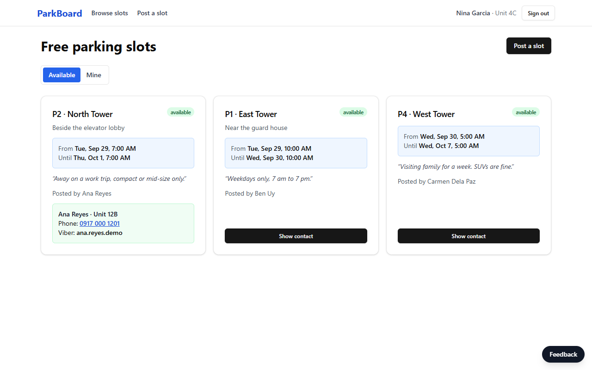
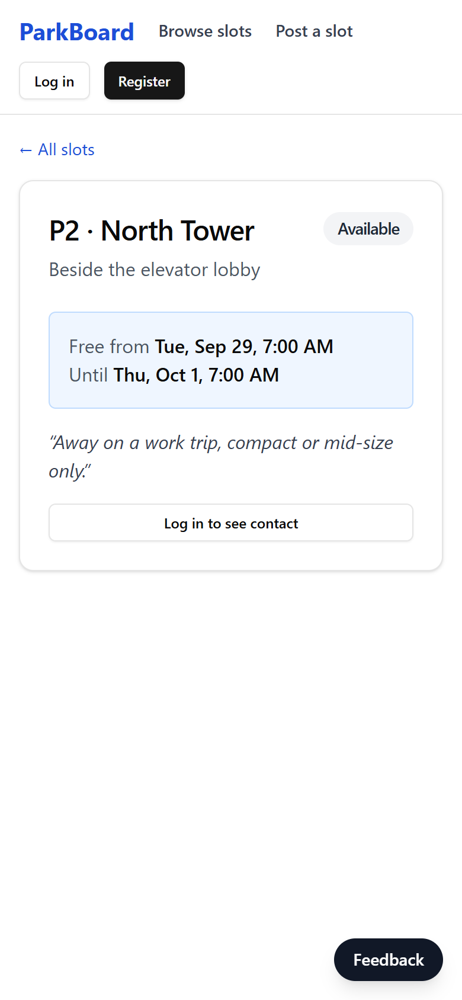
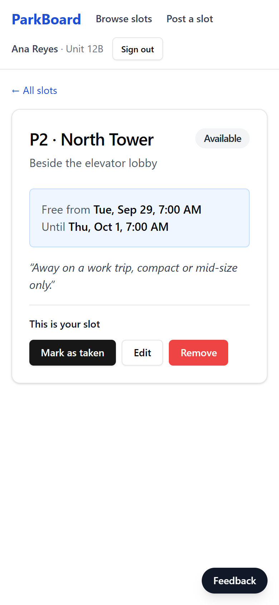
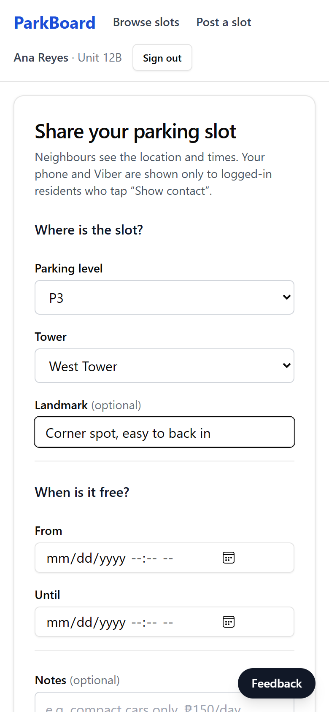
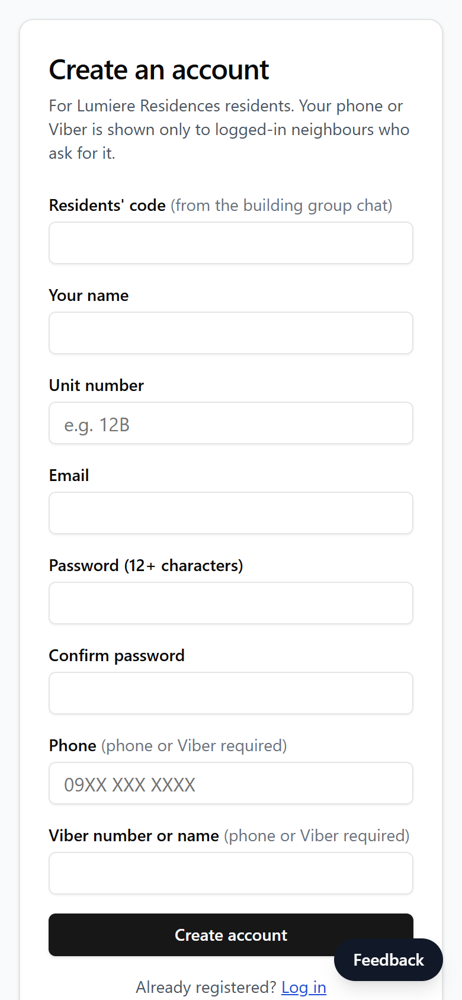
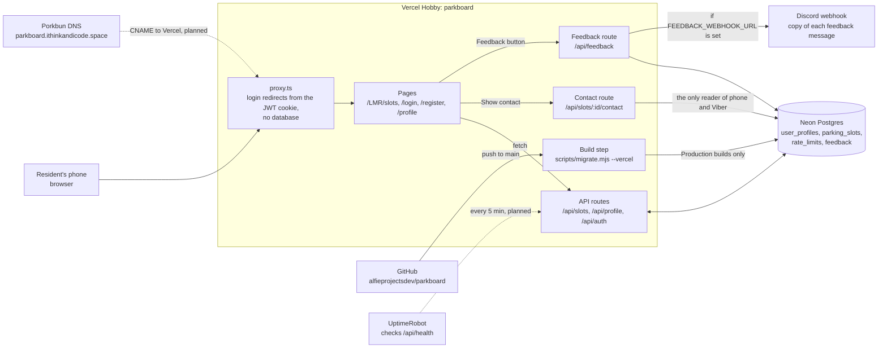
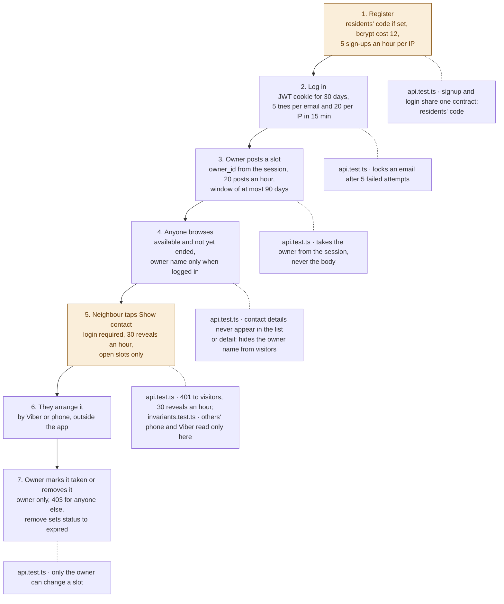

# ParkBoard

A parking-slot board for one condo, Lumiere Residences (LMR). A resident posts
when their slot is free (level, tower, time window). Logged-in neighbours
browse, tap "Show contact" to get the owner's phone or Viber, and arrange the
rest between themselves. The owner marks the slot taken or removes it.

There are no bookings, prices, payments or multiple communities; those were
cut in the v2 rewrite (see [docs/V2_CONTACT_BOARD_PLAN_20260617.md](docs/V2_CONTACT_BOARD_PLAN_20260617.md)).



On a phone: a slot as a logged-out visitor sees it (no contact), the same
slot as its owner sees it, posting a slot, and registering with the
residents' code.

<p>
  
  
  
  
</p>

Screenshots are from a local run on 2026-09-29 with made-up residents.
(`docs/screenshots/` also holds the v1 marketplace screenshots from October
2025.)

## Privacy model

- Anyone can see the list of free slots (location and times only).
- Owner names are shown to logged-in residents only.
- Phone and Viber come from one endpoint, `GET /api/slots/:id/contact`, which
  requires a login and allows 30 look-ups per resident per hour.
- Registration can require a residents' code (`SIGNUP_INVITE_CODE`) shared in
  the building group chat.

## How the system fits together

Two diagrams: first the parts of production and how they connect, then one
slot's path from posting to taken, with the tests pinned to where they
happen. (Mermaid: renders on GitHub and in Notion; VS Code's preview needs the
"Markdown Preview Mermaid Support" extension.)

They show v2 as it runs once the deploy runbook is done. Until then
production still serves the June 2026 v1 build: the v2 production build
fails until `DATABASE_URL` points at a v2 database (runbook steps 1 to 4).
Dashed arrows are planned, not set up yet.



Two arrows carry most of the story. Every page request passes through
`proxy.ts` first, which decides from the signed JWT cookie alone whether the
page needs a login; it never loads `pg` or bcrypt. And only the contact route
reads other residents' phone numbers and Viber names. The slot routes go
through `lib/slots.ts`, which never selects those columns, and `/api/profile`
reads only your own. The build step is the only thing that changes the
schema, and only on Production builds, so a pull request's preview build
never changes it.



Amber marks the two steps that decide who gets a neighbour's phone number.
Step 5 is where it leaves the server. Step 1 is the only gate in front of
step 5: with `SIGNUP_INVITE_CODE` unset, anyone on the internet can register,
and the 30-an-hour limit applies per account, not per person.

Mappings the boxes can't show: the login redirect in `proxy.ts` covers the
post and edit pages (steps 3 and 7) and `/profile`. Show contact and Mark
taken sit on the slot page, which anyone can open, so there the API routes'
own session check does the work (tests named "requires a login" and "returns
401 to anonymous visitors"). Step 5 stops working for neighbours once step 7
marks the slot taken, but still works for the owner. Step 4 lists only slots
whose status is `available` and whose window hasn't ended, so taken, removed
and past slots all drop off it. The build step's tests
(`test/migrate.test.ts`) belong to the first diagram.

## Stack

Next.js 16 (App Router), React 19, TypeScript, Tailwind CSS 3 with shadcn/ui
components, NextAuth v5 (email + password, JWT sessions), PostgreSQL via `pg`
(Neon in production), zod for validation, Vitest + PGlite for tests. Hosted on
Vercel.

## Local development

```bash
npm install
cp .env.example .env.local     # DATABASE_URL and AUTH_SECRET at minimum
npm run db:migrate             # applies db/migrations/*.sql
npm run dev                    # http://localhost:3000
```

| Variable | Required | Purpose |
|----------|----------|---------|
| `DATABASE_URL` | yes | Postgres connection string (Neon pooled URL in production) |
| `AUTH_SECRET` | yes | Signs session JWTs (`openssl rand -base64 32`); `NEXTAUTH_SECRET` also works |
| `SIGNUP_INVITE_CODE` | no | Residents' code required to register |
| `FEEDBACK_WEBHOOK_URL` | no | Discord webhook for the Feedback button |

## Checks

```bash
npm test            # Vitest against PGlite (Postgres in WASM), no database server needed
npm run typecheck
npm run lint
npm run build
```

GitHub Actions is turned off for this repo, so run all four locally before
merging. `.github/workflows/ci.yml` runs them again if Actions is turned back
on.

## Operations

- Forgotten password: `DATABASE_URL=... npm run reset-password -- someone@example.com`
  prints a temporary password to send the resident privately.
- Feedback: `SELECT created_at, kind, message, contact, page FROM feedback ORDER BY created_at DESC;`
- Deploying, secrets and the September 2026 audit: [docs/PRODUCTION_READINESS.md](docs/PRODUCTION_READINESS.md)

## Layout

```
app/api/            route handlers: auth, profile, slots (+ contact), feedback, health
app/LMR/slots/      browse, post, detail, edit
app/(auth)/         login, register
lib/auth/           NextAuth config (auth.config.ts is database-free for proxy.ts)
lib/slots.ts        slot queries (never select phone/Viber)
db/migrations/      numbered SQL, applied by scripts/migrate.mjs
test/               Vitest suites
```
