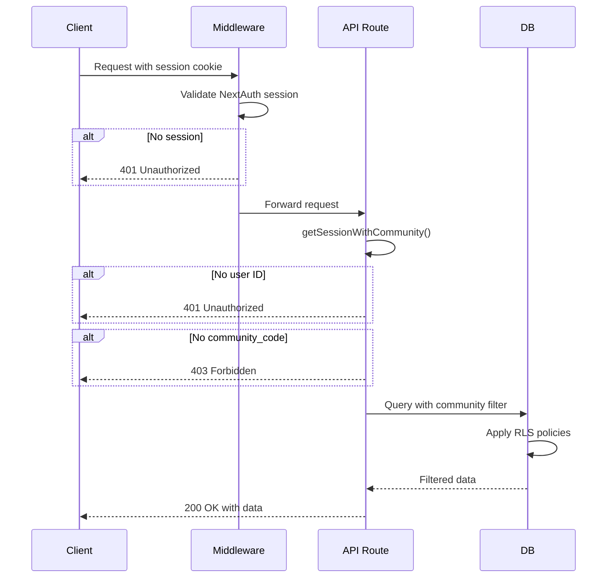

# ParkBoard REST API Design
## Tenant-Isolated API Routes - Security & Architecture

**Version:** 1.0
**Date:** 2025-12-14
**Status:** Design Approved - Ready for Implementation
**Security Priority:** P0-004 Fix (Critical)

---

## Table of Contents

1. [Executive Summary](#executive-summary)
2. [Security Architecture](#security-architecture)
3. [API Endpoints Reference](#api-endpoints-reference)
4. [Request/Response Schemas](#requestresponse-schemas)
5. [Authentication & Authorization](#authentication--authorization)
6. [Error Handling](#error-handling)
7. [Implementation Checklist](#implementation-checklist)
8. [Testing Requirements](#testing-requirements)

---

## Executive Summary

### Problem Statement

**P0-004 Security Issue:** ParkBoard currently uses direct Supabase client queries from page components, creating several critical vulnerabilities:

1. **No centralized tenant isolation validation** - Community filtering depends on client-side code
2. **Business logic scattered across components** - Difficult to audit and maintain
3. **No unified error handling** - Inconsistent error responses across the app
4. **Price manipulation risk** - Client-side booking creation could bypass server-side validation
5. **No API gateway for external integrations** - Cannot safely expose functionality to partners

### Solution Overview

Design and implement **tenant-isolated REST API routes** that:

- ✅ Enforce community isolation at the API layer (defense in depth)
- ✅ Centralize business logic in server-side API routes
- ✅ Provide consistent authentication, authorization, and error handling
- ✅ Prevent price manipulation through server-side calculation
- ✅ Enable future external integrations with proper API gateway

### Design Principles

1. **Security First** - Authentication and tenant isolation are non-negotiable
2. **Defense in Depth** - API layer validation complements RLS policies
3. **Zero Trust** - Never trust client-provided IDs, prices, or community codes
4. **Fail Secure** - Default deny, explicit allow
5. **Audit Trail** - All mutations logged with user context

---

## Security Architecture

### Multi-Layer Security Model

```
┌─────────────────────────────────────────────────────────────────┐
│ Layer 1: Middleware (middleware.ts)                            │
│ ✓ Validates NextAuth session exists                             │
│ ✓ Blocks unauthenticated requests before they reach API routes  │
└─────────────────────────────────────────────────────────────────┘
                              ↓
┌─────────────────────────────────────────────────────────────────┐
│ Layer 2: API Route Authentication (getSessionWithCommunity)    │
│ ✓ Validates session contains user ID                            │
│ ✓ Validates session contains community_code                     │
│ ✓ Extracts userId and communityCode for use in queries          │
└─────────────────────────────────────────────────────────────────┘
                              ↓
┌─────────────────────────────────────────────────────────────────┐
│ Layer 3: Tenant Isolation Validation                           │
│ ✓ ALL queries filtered by communityCode from session            │
│ ✓ ensureCommunityAccess() checks for cross-tenant access        │
│ ✓ Resource ownership verified before mutations                  │
└─────────────────────────────────────────────────────────────────┘
                              ↓
┌─────────────────────────────────────────────────────────────────┐
│ Layer 4: Database RLS Policies (Final Defense)                 │
│ ✓ Row Level Security filters data at database level             │
│ ✓ Prevents data leaks even if API layer has bugs                │
│ ✓ Independent security layer (defense in depth)                 │
└─────────────────────────────────────────────────────────────────┘
```

### Authentication Pattern (Standard for ALL API Routes)

```typescript
import { getSessionWithCommunity } from '@/lib/auth/tenant-access'
import { NextRequest, NextResponse } from 'next/server'

export async function GET(request: NextRequest) {
  // STEP 1: Validate session and extract community context
  const authResult = await getSessionWithCommunity()

  if ('error' in authResult) {
    return NextResponse.json(
      { error: authResult.error },
      { status: authResult.status }
    )
  }

  const { userId, communityCode, session } = authResult

  // STEP 2: ALL queries MUST filter by communityCode
  const { data, error } = await supabaseAdmin
    .from('table_name')
    .select('*')
    .eq('community_code', communityCode)  // ← REQUIRED for tenant isolation

  // STEP 3: Return response
  return NextResponse.json({ data })
}
```

### Critical Security Rules

| Rule | Description | Penalty |
|------|-------------|---------|
| **NEVER accept total_price from client** | Price MUST be calculated by database trigger `calculate_booking_price()` | -$3000 |
| **NEVER skip authentication** | All routes must call `getSessionWithCommunity()` first | -$2000 |
| **NEVER trust client-provided IDs** | Validate ownership and community isolation | -$1500 |
| **NEVER skip Zod validation** | All request bodies must be validated | -$1000 |
| **ALWAYS filter by community_code** | Every query must include `.eq('community_code', communityCode)` | -$1500 |
| **ALWAYS validate resource ownership** | Before mutations, verify user owns the resource | -$1000 |

---

## API Endpoints Reference

### 1. Parking Slots API

#### GET /api/slots
**Purpose:** List available parking slots in user's community

**Authentication:** Required
**Tenant Isolation:** Automatic (filtered by session.user.communityCode)

**Query Parameters:**
| Parameter | Type | Required | Default | Description |
|-----------|------|----------|---------|-------------|
| `status` | `'active' \| 'maintenance' \| 'disabled'` | No | `'active'` | Filter by slot status |
| `type` | `'covered' \| 'uncovered' \| 'tandem'` | No | All | Filter by slot type |
| `min_price` | `number` | No | 0 | Minimum price per hour |
| `max_price` | `number` | No | None | Maximum price per hour |
| `page` | `number` | No | 1 | Page number (1-indexed) |
| `limit` | `number` | No | 20 | Items per page (max: 100) |

**Example Request:**
```bash
GET /api/slots?status=active&type=covered&min_price=5&max_price=15&page=1&limit=20
Authorization: Bearer {nextauth-session-token}
```

**Success Response (200 OK):**
```json
{
  "data": [
    {
      "slot_id": 123,
      "owner_id": "uuid-123",
      "slot_number": "A-10",
      "slot_type": "covered",
      "description": "Close to elevator, easy access",
      "price_per_hour": 10.00,
      "status": "active",
      "created_at": "2025-12-01T10:00:00Z",
      "updated_at": "2025-12-01T10:00:00Z"
    }
  ],
  "meta": {
    "page": 1,
    "limit": 20,
    "total": 45,
    "totalPages": 3
  }
}
```

**Error Responses:**
- `401 Unauthorized` - No valid session
- `403 Forbidden` - No community assigned to user
- `422 Unprocessable Entity` - Invalid query parameters
- `500 Internal Server Error` - Database error

---

#### POST /api/slots
**Purpose:** Create a new parking slot listing

**Authentication:** Required
**Tenant Isolation:** Automatic (community_code set from session)

**Request Body Schema:**
```typescript
{
  slot_number: string       // Required, e.g., "A-10", "B-5"
  slot_type: 'covered' | 'uncovered' | 'tandem'  // Required
  description?: string      // Optional
  price_per_hour: number   // Required, must be > 0
  status?: 'active' | 'maintenance' | 'disabled'  // Optional, default: 'active'
}
```

**Validation Rules:**
- `slot_number`: Must be unique within community (enforced by DB)
- `slot_type`: Must be one of: 'covered', 'uncovered', 'tandem'
- `price_per_hour`: Must be > 0, max 2 decimal places
- `description`: Optional, max 500 characters
- `community_code`: Automatically set from session.user.communityCode (NEVER from client)
- `owner_id`: Automatically set to session.user.id (NEVER from client)

**Example Request:**
```bash
POST /api/slots
Content-Type: application/json
Authorization: Bearer {nextauth-session-token}

{
  "slot_number": "A-10",
  "slot_type": "covered",
  "description": "Close to elevator, ground floor",
  "price_per_hour": 12.50
}
```

**Success Response (201 Created):**
```json
{
  "data": {
    "slot_id": 456,
    "owner_id": "uuid-123",
    "slot_number": "A-10",
    "slot_type": "covered",
    "description": "Close to elevator, ground floor",
    "price_per_hour": 12.50,
    "status": "active",
    "created_at": "2025-12-14T15:30:00Z",
    "updated_at": "2025-12-14T15:30:00Z"
  }
}
```

**Error Responses:**
- `400 Bad Request` - Missing required fields
- `401 Unauthorized` - No valid session
- `403 Forbidden` - No community assigned
- `409 Conflict` - Slot number already exists in community
- `422 Unprocessable Entity` - Invalid field values (e.g., negative price)
- `500 Internal Server Error` - Database error

---

#### PATCH /api/slots/[id]
**Purpose:** Update an existing parking slot (owner only)

**Authentication:** Required
**Authorization:** Must be slot owner
**Tenant Isolation:** Validated (slot must be in user's community)

**Path Parameters:**
| Parameter | Type | Description |
|-----------|------|-------------|
| `id` | `number` | Slot ID to update |

**Request Body Schema:**
```typescript
{
  slot_number?: string      // Optional
  slot_type?: 'covered' | 'uncovered' | 'tandem'  // Optional
  description?: string      // Optional
  price_per_hour?: number  // Optional
  status?: 'active' | 'maintenance' | 'disabled'  // Optional
}
```

**Validation Rules:**
- At least one field must be provided
- Cannot change `owner_id` or `community_code`
- Must own the slot (owner_id === session.user.id)
- Slot must exist in user's community

**Example Request:**
```bash
PATCH /api/slots/456
Content-Type: application/json
Authorization: Bearer {nextauth-session-token}

{
  "price_per_hour": 15.00,
  "description": "Updated description - now includes assigned parking number"
}
```

**Success Response (200 OK):**
```json
{
  "data": {
    "slot_id": 456,
    "owner_id": "uuid-123",
    "slot_number": "A-10",
    "slot_type": "covered",
    "description": "Updated description - now includes assigned parking number",
    "price_per_hour": 15.00,
    "status": "active",
    "created_at": "2025-12-14T15:30:00Z",
    "updated_at": "2025-12-14T16:45:00Z"
  }
}
```

**Error Responses:**
- `400 Bad Request` - No fields to update
- `401 Unauthorized` - No valid session
- `403 Forbidden` - Not the slot owner OR slot in different community
- `404 Not Found` - Slot doesn't exist
- `422 Unprocessable Entity` - Invalid field values
- `500 Internal Server Error` - Database error

---

#### DELETE /api/slots/[id]
**Purpose:** Delete a parking slot (owner only, if no active bookings)

**Authentication:** Required
**Authorization:** Must be slot owner
**Tenant Isolation:** Validated (slot must be in user's community)

**Path Parameters:**
| Parameter | Type | Description |
|-----------|------|-------------|
| `id` | `number` | Slot ID to delete |

**Validation Rules:**
- Must own the slot (owner_id === session.user.id)
- Slot must exist in user's community
- No active bookings (status = 'pending' or 'confirmed')

**Example Request:**
```bash
DELETE /api/slots/456
Authorization: Bearer {nextauth-session-token}
```

**Success Response (200 OK):**
```json
{
  "success": true,
  "message": "Slot deleted successfully"
}
```

**Error Responses:**
- `401 Unauthorized` - No valid session
- `403 Forbidden` - Not the slot owner OR slot in different community
- `404 Not Found` - Slot doesn't exist
- `409 Conflict` - Slot has active bookings (cannot delete)
- `500 Internal Server Error` - Database error

---

### 2. Bookings API

#### GET /api/bookings
**Purpose:** List user's bookings (as renter or slot owner)

**Authentication:** Required
**Tenant Isolation:** Automatic (bookings filtered by user and community)

**Query Parameters:**
| Parameter | Type | Required | Default | Description |
|-----------|------|----------|---------|-------------|
| `status` | `'pending' \| 'confirmed' \| 'cancelled' \| 'completed' \| 'no_show'` | No | All | Filter by booking status |
| `role` | `'renter' \| 'owner'` | No | Both | Filter by user role |
| `start_date` | `ISO 8601 date` | No | None | Filter bookings starting after this date |
| `end_date` | `ISO 8601 date` | No | None | Filter bookings ending before this date |
| `page` | `number` | No | 1 | Page number (1-indexed) |
| `limit` | `number` | No | 20 | Items per page (max: 100) |

**Example Request:**
```bash
GET /api/bookings?status=confirmed&role=renter&page=1&limit=10
Authorization: Bearer {nextauth-session-token}
```

**Success Response (200 OK):**
```json
{
  "data": [
    {
      "booking_id": 789,
      "slot_id": 123,
      "renter_id": "uuid-123",
      "slot_owner_id": "uuid-456",
      "start_time": "2025-12-20T08:00:00Z",
      "end_time": "2025-12-20T18:00:00Z",
      "total_price": 100.00,
      "status": "confirmed",
      "created_at": "2025-12-14T10:00:00Z",
      "updated_at": "2025-12-14T10:00:00Z",
      "slot": {
        "slot_number": "A-10",
        "slot_type": "covered",
        "owner": {
          "name": "John Doe",
          "phone": "+1234567890"
        }
      }
    }
  ],
  "meta": {
    "page": 1,
    "limit": 10,
    "total": 25,
    "totalPages": 3
  }
}
```

**Error Responses:**
- `401 Unauthorized` - No valid session
- `403 Forbidden` - No community assigned
- `422 Unprocessable Entity` - Invalid query parameters
- `500 Internal Server Error` - Database error

---

#### POST /api/bookings
**Purpose:** Create a new booking (rent a parking slot)

**Authentication:** Required
**Tenant Isolation:** Validated (slot must be in user's community)

**CRITICAL SECURITY:** Total price is calculated server-side by database trigger. Client MUST NOT provide `total_price`.

**Request Body Schema:**
```typescript
{
  slot_id: number          // Required
  start_time: string       // Required, ISO 8601 format
  end_time: string         // Required, ISO 8601 format
}
```

**Validation Rules:**
- `slot_id`: Must exist and be in user's community
- `start_time`: Must be in the future
- `end_time`: Must be after start_time
- No overlapping bookings for the same slot
- Slot must have `status = 'active'`
- `total_price`: NEVER accepted from client (calculated by DB trigger)
- `renter_id`: Automatically set to session.user.id
- `slot_owner_id`: Automatically populated by DB trigger
- `status`: Default 'pending' (can be auto-confirmed based on business rules)

**Example Request:**
```bash
POST /api/bookings
Content-Type: application/json
Authorization: Bearer {nextauth-session-token}

{
  "slot_id": 123,
  "start_time": "2025-12-20T08:00:00Z",
  "end_time": "2025-12-20T18:00:00Z"
}
```

**Success Response (201 Created):**
```json
{
  "data": {
    "booking_id": 789,
    "slot_id": 123,
    "renter_id": "uuid-123",
    "slot_owner_id": "uuid-456",
    "start_time": "2025-12-20T08:00:00Z",
    "end_time": "2025-12-20T18:00:00Z",
    "total_price": 100.00,  // ← Calculated by database trigger
    "status": "pending",
    "created_at": "2025-12-14T16:30:00Z",
    "updated_at": "2025-12-14T16:30:00Z"
  }
}
```

**Error Responses:**
- `400 Bad Request` - Missing required fields OR start_time in past
- `401 Unauthorized` - No valid session
- `403 Forbidden` - Slot not in user's community
- `404 Not Found` - Slot doesn't exist
- `409 Conflict` - Overlapping booking exists
- `422 Unprocessable Entity` - Invalid time range (end before start)
- `500 Internal Server Error` - Database error

---

#### PATCH /api/bookings/[id]
**Purpose:** Update booking status (cancel only for MVP)

**Authentication:** Required
**Authorization:** Must be renter OR slot owner
**Tenant Isolation:** Validated

**Path Parameters:**
| Parameter | Type | Description |
|-----------|------|-------------|
| `id` | `number` | Booking ID to update |

**Request Body Schema:**
```typescript
{
  status: 'cancelled'  // Only cancellation allowed for MVP
}
```

**Validation Rules:**
- User must be renter OR slot owner
- Can only change status to 'cancelled'
- Cannot cancel already completed bookings
- Booking must exist in user's community (via slot's community)

**Example Request:**
```bash
PATCH /api/bookings/789
Content-Type: application/json
Authorization: Bearer {nextauth-session-token}

{
  "status": "cancelled"
}
```

**Success Response (200 OK):**
```json
{
  "data": {
    "booking_id": 789,
    "slot_id": 123,
    "renter_id": "uuid-123",
    "slot_owner_id": "uuid-456",
    "start_time": "2025-12-20T08:00:00Z",
    "end_time": "2025-12-20T18:00:00Z",
    "total_price": 100.00,
    "status": "cancelled",
    "created_at": "2025-12-14T16:30:00Z",
    "updated_at": "2025-12-14T17:00:00Z"
  }
}
```

**Error Responses:**
- `400 Bad Request` - Invalid status (only 'cancelled' allowed)
- `401 Unauthorized` - No valid session
- `403 Forbidden` - Not renter or slot owner
- `404 Not Found` - Booking doesn't exist
- `422 Unprocessable Entity` - Cannot cancel completed booking
- `500 Internal Server Error` - Database error

---

### 3. Profile API

#### GET /api/profile
**Purpose:** Get current user's profile information

**Authentication:** Required
**Tenant Isolation:** Returns only authenticated user's data

**Example Request:**
```bash
GET /api/profile
Authorization: Bearer {nextauth-session-token}
```

**Success Response (200 OK):**
```json
{
  "data": {
    "id": "uuid-123",
    "name": "Jane Smith",
    "email": "jane@example.com",
    "phone": "+1234567890",
    "unit_number": "101",
    "community_code": "LMR",
    "community": {
      "community_code": "LMR",
      "name": "La Mirada Residences",
      "status": "active"
    },
    "created_at": "2025-01-01T00:00:00Z",
    "updated_at": "2025-12-14T10:00:00Z"
  }
}
```

**Error Responses:**
- `401 Unauthorized` - No valid session
- `403 Forbidden` - No community assigned
- `404 Not Found` - Profile doesn't exist (data inconsistency)
- `500 Internal Server Error` - Database error

---

#### PATCH /api/profile
**Purpose:** Update current user's profile (limited fields)

**Authentication:** Required
**Tenant Isolation:** Can only update own profile

**Request Body Schema:**
```typescript
{
  name?: string        // Optional
  phone?: string       // Optional
}
```

**Validation Rules:**
- Cannot change: `email`, `unit_number`, `community_code`, `id`
- `name`: 2-100 characters
- `phone`: Valid phone format (E.164 recommended)

**Example Request:**
```bash
PATCH /api/profile
Content-Type: application/json
Authorization: Bearer {nextauth-session-token}

{
  "name": "Jane Smith-Johnson",
  "phone": "+1234567899"
}
```

**Success Response (200 OK):**
```json
{
  "data": {
    "id": "uuid-123",
    "name": "Jane Smith-Johnson",
    "email": "jane@example.com",
    "phone": "+1234567899",
    "unit_number": "101",
    "community_code": "LMR",
    "created_at": "2025-01-01T00:00:00Z",
    "updated_at": "2025-12-14T17:30:00Z"
  }
}
```

**Error Responses:**
- `400 Bad Request` - No fields to update OR attempt to change immutable fields
- `401 Unauthorized` - No valid session
- `422 Unprocessable Entity` - Invalid field values
- `500 Internal Server Error` - Database error

---

## Request/Response Schemas

### Zod Validation Schemas

Location: `/home/finch/repos/parkboard/lib/validation/api-schemas.ts`

```typescript
import { z } from 'zod'

// ============================================================================
// PARKING SLOTS SCHEMAS
// ============================================================================

export const SlotQuerySchema = z.object({
  status: z.enum(['active', 'maintenance', 'disabled']).optional(),
  type: z.enum(['covered', 'uncovered', 'tandem']).optional(),
  min_price: z.coerce.number().min(0).optional(),
  max_price: z.coerce.number().min(0).optional(),
  page: z.coerce.number().int().min(1).default(1),
  limit: z.coerce.number().int().min(1).max(100).default(20),
})

export const CreateSlotSchema = z.object({
  slot_number: z.string().min(1).max(20),
  slot_type: z.enum(['covered', 'uncovered', 'tandem']),
  description: z.string().max(500).optional(),
  price_per_hour: z.number().positive().multipleOf(0.01),
  status: z.enum(['active', 'maintenance', 'disabled']).default('active'),
})

export const UpdateSlotSchema = z.object({
  slot_number: z.string().min(1).max(20).optional(),
  slot_type: z.enum(['covered', 'uncovered', 'tandem']).optional(),
  description: z.string().max(500).optional(),
  price_per_hour: z.number().positive().multipleOf(0.01).optional(),
  status: z.enum(['active', 'maintenance', 'disabled']).optional(),
}).refine((data) => Object.keys(data).length > 0, {
  message: 'At least one field must be provided for update',
})

// ============================================================================
// BOOKINGS SCHEMAS
// ============================================================================

export const BookingQuerySchema = z.object({
  status: z.enum(['pending', 'confirmed', 'cancelled', 'completed', 'no_show']).optional(),
  role: z.enum(['renter', 'owner']).optional(),
  start_date: z.string().datetime().optional(),
  end_date: z.string().datetime().optional(),
  page: z.coerce.number().int().min(1).default(1),
  limit: z.coerce.number().int().min(1).max(100).default(20),
})

export const CreateBookingSchema = z.object({
  slot_id: z.number().int().positive(),
  start_time: z.string().datetime(),
  end_time: z.string().datetime(),
}).refine((data) => new Date(data.end_time) > new Date(data.start_time), {
  message: 'end_time must be after start_time',
  path: ['end_time'],
}).refine((data) => new Date(data.start_time) > new Date(), {
  message: 'start_time must be in the future',
  path: ['start_time'],
})

export const UpdateBookingSchema = z.object({
  status: z.literal('cancelled'),  // MVP: Only allow cancellation
})

// ============================================================================
// PROFILE SCHEMAS
// ============================================================================

export const UpdateProfileSchema = z.object({
  name: z.string().min(2).max(100).optional(),
  phone: z.string().regex(/^\+?[1-9]\d{1,14}$/).optional(),  // E.164 format
}).refine((data) => Object.keys(data).length > 0, {
  message: 'At least one field must be provided for update',
})

// ============================================================================
// HELPER FUNCTIONS
// ============================================================================

/**
 * Validates request body against Zod schema
 * Returns validated data or NextResponse with error
 */
export function validateRequestBody<T>(
  schema: z.ZodSchema<T>,
  body: unknown
): { success: true; data: T } | { success: false; error: z.ZodError } {
  const result = schema.safeParse(body)

  if (!result.success) {
    return { success: false, error: result.error }
  }

  return { success: true, data: result.data }
}

/**
 * Validates query parameters against Zod schema
 */
export function validateQueryParams<T>(
  schema: z.ZodSchema<T>,
  params: URLSearchParams
): { success: true; data: T } | { success: false; error: z.ZodError } {
  const obj = Object.fromEntries(params.entries())
  const result = schema.safeParse(obj)

  if (!result.success) {
    return { success: false, error: result.error }
  }

  return { success: true, data: result.data }
}
```

---

## Authentication & Authorization

### Authentication Flow



### Authorization Matrix

| Endpoint | Authentication | Authorization Check | Tenant Isolation |
|----------|---------------|---------------------|------------------|
| `GET /api/slots` | Required | None (public within community) | Filter by communityCode |
| `POST /api/slots` | Required | None (any user can create) | Set communityCode from session |
| `PATCH /api/slots/[id]` | Required | Must be owner | Verify slot.community_code === session.communityCode |
| `DELETE /api/slots/[id]` | Required | Must be owner | Verify slot.community_code === session.communityCode |
| `GET /api/bookings` | Required | Own bookings only | Filter renter_id OR slot_owner_id |
| `POST /api/bookings` | Required | None (any user can book) | Verify slot in same community |
| `PATCH /api/bookings/[id]` | Required | Must be renter OR owner | Verify via slot's community |
| `GET /api/profile` | Required | Own profile only | session.user.id |
| `PATCH /api/profile` | Required | Own profile only | session.user.id |

---

## Error Handling

### Standard Error Response Format

```json
{
  "error": "Human-readable error message",
  "details": {
    "field": "start_time",
    "issue": "Must be in the future"
  }
}
```

### HTTP Status Codes

| Code | Meaning | Use Case |
|------|---------|----------|
| `200` | OK | Successful GET, PATCH, DELETE |
| `201` | Created | Successful POST |
| `400` | Bad Request | Missing required fields, invalid JSON |
| `401` | Unauthorized | No valid session, authentication failed |
| `403` | Forbidden | No community assigned, insufficient permissions |
| `404` | Not Found | Resource doesn't exist |
| `409` | Conflict | Duplicate slot number, overlapping booking |
| `422` | Unprocessable Entity | Validation errors (Zod), invalid field values |
| `500` | Internal Server Error | Database errors, unexpected exceptions |

### Error Response Examples

**Validation Error (422):**
```json
{
  "error": "Validation failed",
  "details": [
    {
      "field": "price_per_hour",
      "message": "Number must be greater than 0"
    },
    {
      "field": "slot_type",
      "message": "Invalid enum value. Expected 'covered' | 'uncovered' | 'tandem'"
    }
  ]
}
```

**Authorization Error (403):**
```json
{
  "error": "Access denied to other communities"
}
```

**Conflict Error (409):**
```json
{
  "error": "Slot number A-10 already exists in community LMR"
}
```

**Database Error (500):**
```json
{
  "error": "Internal server error"
}
```

**Note:** Database error details should NOT be exposed to clients. Log full errors server-side.

---

## Implementation Checklist

### Phase 1: Foundation (Week 1)

- [ ] **Task 1.1:** Create Zod validation schemas (`lib/validation/api-schemas.ts`)
  - [ ] Slot schemas (query, create, update)
  - [ ] Booking schemas (query, create, update)
  - [ ] Profile schemas (update)
  - [ ] Helper functions for validation
  - **Estimated Time:** 4 hours

- [ ] **Task 1.2:** Create API error handling utilities (`lib/utils/api-errors.ts`)
  - [ ] Error response formatter
  - [ ] Zod error transformer
  - [ ] HTTP status code helpers
  - **Estimated Time:** 2 hours

- [ ] **Task 1.3:** Write unit tests for validation schemas
  - [ ] Test valid inputs
  - [ ] Test invalid inputs
  - [ ] Test edge cases
  - **Estimated Time:** 4 hours

### Phase 2: Slots API (Week 1-2)

- [ ] **Task 2.1:** Implement `GET /api/slots` (`app/api/slots/route.ts`)
  - [ ] Authentication check
  - [ ] Query parameter validation
  - [ ] Community filtering
  - [ ] Pagination logic
  - [ ] Response formatting
  - **Estimated Time:** 6 hours

- [ ] **Task 2.2:** Implement `POST /api/slots`
  - [ ] Authentication check
  - [ ] Request body validation
  - [ ] Set community_code and owner_id from session
  - [ ] Handle duplicate slot_number (409)
  - [ ] Response formatting
  - **Estimated Time:** 4 hours

- [ ] **Task 2.3:** Implement `PATCH /api/slots/[id]` (`app/api/slots/[id]/route.ts`)
  - [ ] Authentication check
  - [ ] Ownership verification
  - [ ] Community isolation check
  - [ ] Request body validation
  - [ ] Handle not found (404)
  - **Estimated Time:** 5 hours

- [ ] **Task 2.4:** Implement `DELETE /api/slots/[id]`
  - [ ] Authentication check
  - [ ] Ownership verification
  - [ ] Check for active bookings (409)
  - [ ] Delete operation
  - **Estimated Time:** 4 hours

- [ ] **Task 2.5:** Write integration tests for Slots API
  - [ ] Test happy paths
  - [ ] Test authorization failures
  - [ ] Test tenant isolation
  - [ ] Test edge cases
  - **Estimated Time:** 8 hours

### Phase 3: Bookings API (Week 2-3)

- [ ] **Task 3.1:** Implement `GET /api/bookings` (`app/api/bookings/route.ts`)
  - [ ] Authentication check
  - [ ] Query parameter validation
  - [ ] Filter by role (renter vs owner)
  - [ ] Date range filtering
  - [ ] Pagination logic
  - [ ] Include related data (slot, owner)
  - **Estimated Time:** 6 hours

- [ ] **Task 3.2:** Implement `POST /api/bookings`
  - [ ] Authentication check
  - [ ] Request body validation
  - [ ] Verify slot exists and is in same community
  - [ ] Check time in future
  - [ ] Handle overlap (409)
  - [ ] NEVER accept total_price from client
  - [ ] Response formatting
  - **Estimated Time:** 6 hours

- [ ] **Task 3.3:** Implement `PATCH /api/bookings/[id]` (`app/api/bookings/[id]/route.ts`)
  - [ ] Authentication check
  - [ ] Authorization (renter OR owner)
  - [ ] Only allow status = 'cancelled'
  - [ ] Validate not already completed
  - **Estimated Time:** 4 hours

- [ ] **Task 3.4:** Write integration tests for Bookings API
  - [ ] Test booking creation (happy path)
  - [ ] Test overlap prevention
  - [ ] Test cross-community booking prevention
  - [ ] Test cancellation by renter and owner
  - [ ] Test authorization failures
  - **Estimated Time:** 10 hours

### Phase 4: Profile API (Week 3)

- [ ] **Task 4.1:** Implement `GET /api/profile` (`app/api/profile/route.ts`)
  - [ ] Authentication check
  - [ ] Fetch user profile
  - [ ] Include community data
  - **Estimated Time:** 2 hours

- [ ] **Task 4.2:** Implement `PATCH /api/profile`
  - [ ] Authentication check
  - [ ] Request body validation
  - [ ] Reject immutable field changes
  - [ ] Update profile
  - **Estimated Time:** 3 hours

- [ ] **Task 4.3:** Write integration tests for Profile API
  - [ ] Test profile fetch
  - [ ] Test profile update
  - [ ] Test immutable field protection
  - **Estimated Time:** 4 hours

### Phase 5: Migration & Documentation (Week 4)

- [ ] **Task 5.1:** Migrate existing pages to use API routes
  - [ ] Update `app/LMR/slots/page.tsx` to call `GET /api/slots`
  - [ ] Update `app/LMR/bookings/page.tsx` to call `GET /api/bookings`
  - [ ] Update booking creation form to call `POST /api/bookings`
  - [ ] Update slot creation form to call `POST /api/slots`
  - **Estimated Time:** 8 hours

- [ ] **Task 5.2:** E2E testing with Playwright
  - [ ] Test full booking flow via API
  - [ ] Test slot creation flow via API
  - [ ] Test error scenarios
  - **Estimated Time:** 6 hours

- [ ] **Task 5.3:** Update documentation
  - [ ] API reference in README
  - [ ] Update CLAUDE.md with API patterns
  - [ ] Create migration guide for developers
  - **Estimated Time:** 4 hours

### Total Estimated Time: 90 hours (~2-3 weeks for 1 developer)

---

## Testing Requirements

### Unit Tests (Jest)

Location: `/home/finch/repos/parkboard/__tests__/api/`

**File Structure:**
```
__tests__/
├── api/
│   ├── validation/
│   │   ├── slot-schemas.test.ts
│   │   ├── booking-schemas.test.ts
│   │   └── profile-schemas.test.ts
│   ├── slots/
│   │   ├── get-slots.test.ts
│   │   ├── create-slot.test.ts
│   │   ├── update-slot.test.ts
│   │   └── delete-slot.test.ts
│   ├── bookings/
│   │   ├── get-bookings.test.ts
│   │   ├── create-booking.test.ts
│   │   └── update-booking.test.ts
│   └── profile/
│       ├── get-profile.test.ts
│       └── update-profile.test.ts
```

**Test Coverage Requirements:**

1. **Validation Tests:**
   - Valid inputs pass
   - Invalid inputs fail with correct messages
   - Edge cases (empty strings, negative numbers, etc.)

2. **Authentication Tests:**
   - Unauthenticated requests return 401
   - Missing community_code returns 403
   - Valid session proceeds

3. **Authorization Tests:**
   - Non-owners cannot update/delete slots
   - Non-renters/non-owners cannot cancel bookings
   - Cross-community access denied

4. **Tenant Isolation Tests:**
   - Users only see data from their community
   - Cannot create resources in other communities
   - Cannot access resources from other communities

5. **Business Logic Tests:**
   - Price calculated server-side (never from client)
   - Overlap prevention works
   - Duplicate slot numbers rejected
   - Time validation (future dates only)

### Integration Tests (Playwright)

Location: `/home/finch/repos/parkboard/e2e/api/`

**Test Scenarios:**

1. **Happy Path Scenarios:**
   ```typescript
   test('User can create slot, book it, and cancel booking', async ({ request }) => {
     // Login
     // Create slot via POST /api/slots
     // Book slot via POST /api/bookings
     // Verify booking via GET /api/bookings
     // Cancel via PATCH /api/bookings/[id]
     // Verify cancellation
   })
   ```

2. **Error Scenarios:**
   ```typescript
   test('Cannot book slot in different community', async ({ request }) => {
     // Login as user in LMR
     // Attempt to book slot in SRP community
     // Expect 403 Forbidden
   })
   ```

3. **Race Condition Tests:**
   ```typescript
   test('Overlapping bookings are prevented', async ({ request }) => {
     // Create slot
     // Create booking 1 (10am-2pm)
     // Attempt booking 2 (12pm-4pm)
     // Expect 409 Conflict
   })
   ```

### Performance Tests

**Metrics to Track:**
- API response time < 200ms (p95)
- Database query time < 50ms (p95)
- Pagination works efficiently for large datasets (1000+ records)

**Load Testing (Future):**
- 100 concurrent users
- 1000 requests/minute
- No degradation in response time

---

## Appendix A: Database Considerations

### Required Database Changes

**None required.** The current schema in `db/schema_optimized.sql` already supports all API requirements:

- ✅ Multi-tenant via `community_code` column
- ✅ Server-side price calculation via `calculate_booking_price()` trigger
- ✅ Overlap prevention via `no_overlap` EXCLUDE constraint
- ✅ RLS policies for authorization
- ✅ Indexes for performance

### Future Enhancements

1. **Audit Logging Table:**
   ```sql
   CREATE TABLE api_audit_log (
     log_id SERIAL PRIMARY KEY,
     user_id UUID REFERENCES user_profiles(id),
     community_code TEXT,
     endpoint TEXT NOT NULL,
     method TEXT NOT NULL,
     status_code INT NOT NULL,
     request_body JSONB,
     response_body JSONB,
     ip_address INET,
     created_at TIMESTAMPTZ DEFAULT NOW()
   );
   ```

2. **Rate Limiting Table:**
   ```sql
   CREATE TABLE api_rate_limits (
     user_id UUID REFERENCES user_profiles(id),
     endpoint TEXT NOT NULL,
     request_count INT DEFAULT 0,
     window_start TIMESTAMPTZ DEFAULT NOW(),
     PRIMARY KEY (user_id, endpoint)
   );
   ```

---

## Appendix B: Migration Strategy

### Phased Rollout

**Phase 1: API Routes Only (Week 1-3)**
- Implement all API routes
- Test thoroughly
- Do NOT change existing pages yet
- Both old (direct Supabase) and new (API) methods work

**Phase 2: Gradual Migration (Week 4)**
- Start with lowest-risk pages (slots listing)
- Migrate one page at a time
- Monitor for errors
- Rollback capability if issues found

**Phase 3: Deprecate Direct Queries (Week 5)**
- Remove direct Supabase queries from pages
- All data access via API routes
- Update documentation

### Rollback Plan

If critical issues found:
1. Revert page components to direct Supabase queries
2. Keep API routes (no harm in having them)
3. Fix issues
4. Re-attempt migration

### Feature Flags (Optional)

```typescript
// lib/config/feature-flags.ts
export const USE_API_ROUTES = process.env.NEXT_PUBLIC_USE_API_ROUTES === 'true'

// In component:
const fetchSlots = USE_API_ROUTES ? fetchSlotsViaAPI : fetchSlotsViaSupabase
```

---

## Appendix C: Security Audit Checklist

Before going to production, verify:

- [ ] All API routes call `getSessionWithCommunity()` first
- [ ] All queries filter by `community_code`
- [ ] All mutations verify resource ownership
- [ ] `total_price` NEVER accepted from client
- [ ] All request bodies validated with Zod
- [ ] Error messages don't leak sensitive data
- [ ] Rate limiting implemented (future)
- [ ] Audit logging enabled (future)
- [ ] CORS configured properly
- [ ] Environment variables not exposed to client
- [ ] SQL injection prevented (using Supabase query builder)
- [ ] XSS prevented (React escapes by default)

---

## Conclusion

This API design provides a **secure, scalable, and maintainable** foundation for ParkBoard's REST API layer. By implementing tenant isolation at the API level (in addition to RLS), we achieve **defense in depth** and prepare for future integrations.

**Key Benefits:**
1. ✅ Fixes P0-004 security issue (tenant isolation)
2. ✅ Centralizes business logic
3. ✅ Enables external integrations
4. ✅ Improves code maintainability
5. ✅ Provides audit trail capability

**Next Steps:**
1. Review this design document with team
2. Approve implementation plan
3. Assign to @agent-developer for incremental implementation
4. Start with Phase 1 (Foundation)

---

**Document Version:** 1.0
**Last Updated:** 2025-12-14
**Approved By:** [Pending Review]
**Implementation Start Date:** [TBD]
