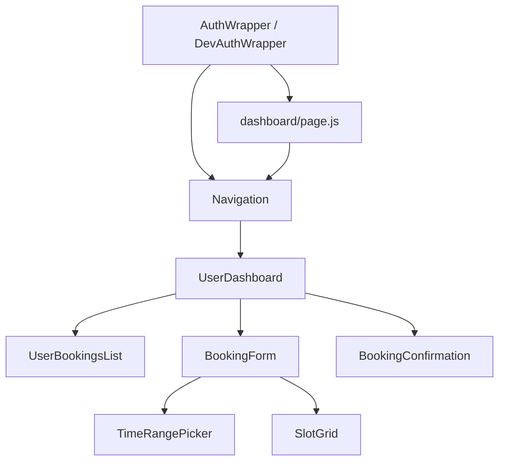

I have exported my entire ParkBoard Next.js front-end project and key config files into a Markdown file. 
Please help me analyze it with reference to the CONTEXT RESYNC — ParkBoard App (MVP).

Tasks:
1. Identify all import errors, missing modules, or unresolved file paths.
2. Detect components that must be `"use client"` vs `"use server"` for App Router.
3. Highlight JS/TS/JSX/TSX type inconsistencies or mixed usages that may break the build.
4. Detect circular dependencies or files with unresolved references.
5. Analyze config/project files (`next.config.js`, `tsconfig.json`, Tailwind/PostCSS) for errors.
6. Suggest the minimal set of files to fix first to get `http://localhost:3000/dashboard` rendering.
7. Give a step-by-step action plan to restore full resident dashboard functionality with prioritized fixes.

Output format:
- Bullet-point report with specific files and lines causing issues.
- Recommended fixes per file.
- Suggested order to apply fixes for quickest working render.


---

## 🟢 Priority Walk-Through: ParkBoard Front-End



### Step-by-Step Fix Priority

1. **AuthWrapper.js / DevAuthWrapper.js**

   * Must be `"use client"` because it uses `createContext` and React hooks.
   * Fix any client/server errors here first; all other components depend on user auth context.

2. **Navigation.js**

   * Relies on `useAuth` context.
   * Ensure `supabase` import is correct.
   * Check role-based rendering (`admin` vs `resident`).

3. **dashboard/page.js**

   * Entry point for `/dashboard`.
   * Import AuthWrapper and Navigation.
   * Ensure `"use client"` if needed.
   * Minimal test: render `<div>Dashboard</div>` to verify page renders before adding nested components.

4. **UserDashboard.js**

   * Depends on AuthWrapper and Navigation context.
   * Tabs: `My Bookings` and `New Booking`.
   * Next, test that tabs switch correctly and render placeholder content before hooking API.

5. **UserBookingsList.js**

   * Fetches bookings for the user.
   * Ensure `userId` is passed correctly from `profile.id`.
   * Minimal test: mock bookings array to see UI renders.

6. **BookingForm.js**

   * Depends on `TimeRangePicker` and `SlotGrid`.
   * Ensure API endpoint `/api/bookings` exists.
   * Minimal test: render with mock slots and time range first.

7. **TimeRangePicker.js**

   * Handles date/time selection.
   * Minimal test: check `onChange` fires and returns ISO strings.

8. **SlotGrid.js**

   * Depends on booking data.
   * Minimal test: render static slots to verify coloring and click behavior.

9. **BookingConfirmation.js**

   * Last component in flow.
   * Minimal test: render with mock booking object.

---

### 📝 Suggested Fix Order

1. `AuthWrapper.js` → `DevAuthWrapper.js` → `"use client"` directive + resolve supabase context.
2. `Navigation.js` → test role-based links.
3. `dashboard/page.js` → minimal rendering, no nested components yet.
4. `UserDashboard.js` → tabs render correctly with placeholders.
5. `UserBookingsList.js` → test static bookings.
6. `BookingForm.js` → integrate `TimeRangePicker` and `SlotGrid` with static data.
7. `TimeRangePicker.js` → ensure date/time selection works.
8. `SlotGrid.js` → render with static slots, check color/status.
9. `BookingConfirmation.js` → test static confirmation.
10. Hook everything up to `supabase` APIs incrementally.

---

### ✅ Quick Test After Each Step

* Start local dev: `npm run dev`.
* Open `/dashboard`.
* Confirm at each step that something renders (even a placeholder) to catch import/client errors early.
* Only integrate API calls after UI components render without errors.

### CONTEXT RESYNC — ParkBoard App (MVP)
Absolutely. Here's a **fresh CONTEXT RESYNC prompt** you can use tomorrow to start a new ChatGPT thread for ParkBoard, reflecting all your current MVP setup and front-end dependency considerations:

---

## CONTEXT RESYNC — ParkBoard App (MVP)

**Project Overview:**
ParkBoard is a condo/community parking booking web app built on **Next.js (App Router)** with **Supabase** backend. The MVP targets residents and admins, allowing:

* Residents to view bookings, book available slots, and cancel bookings.
* Admins to manage slots and monitor bookings.

---

### Current Status

**Database (Supabase, dev/testing):**

* `user_profiles` (UUIDs used, FK to `auth.users` temporarily disabled for local testing)
* `parking_slots`
* `bookings`
* `payments`

All tables seeded via `wipe_and_seed_testing.sql` (dev-friendly version). `Option A — Fake UUIDs` is in use for testing flows.

**Front-End Components:**

* `AuthWrapper.js` / `DevAuthWrapper.js` → Provides React context for authentication. Must be marked `"use client"` due to hooks usage.
* `Navigation.js` → Header, user info, and role-based links. Depends on AuthWrapper.
* `dashboard/page.js` → Resident dashboard entry point; imports AuthWrapper and Navigation.
* `UserDashboard.js` → Main resident dashboard; tabs for bookings/new booking.
* `UserBookingsList.js` → Displays current bookings for the resident.
* `BookingForm.js` → Handles slot booking; imports `TimeRangePicker` and `SlotGrid`.
* `TimeRangePicker.js` → Date/time selection component.
* `SlotGrid.js` → Displays available slots, shows status, allows selection.
* `BookingConfirmation.js` → Success state after booking.

**Current Issues / Known Problems:**

1. **Mix of `.js`, `.jsx`, `.ts`, `.tsx`** causing import/build inconsistencies.
2. **Client vs Server Component mismatches** (React hooks like `useContext` and `useState` require `"use client"`).
3. `/dashboard` currently renders blank due to component import/build issues.
4. Some API endpoints (e.g., `/api/bookings`) may be stubbed for testing.

**Next.js Structure (MVP focus):**

```
app/
  dashboard/page.js
  login/page.tsx
components/
  AuthWrapper.js
  DevAuthWrapper.js
  Navigation.js
  UserDashboard.js
  UserBookingsList.js
  BookingForm.js
  TimeRangePicker.js
  SlotGrid.js
  BookingConfirmation.js
lib/
  supabase.js
pages/api/
  bookings.js (POST/GET)
```

**Testing Strategy:**

* Fix AuthWrapper and Navigation first (must render without errors).
* Walk components in dependency order:
  `AuthWrapper → Navigation → dashboard/page → UserDashboard → [UserBookingsList | BookingForm → SlotGrid & TimeRangePicker] → BookingConfirmation`.
* Start with static/mock data for components, then integrate API calls incrementally.
* Check `console.log` and network requests for Supabase errors after each integration step.

---

**Prompt for Next Thread:**

> “We are working on the ParkBoard MVP. The dev environment uses Next.js (App Router) and Supabase, with all tables seeded for testing. The resident dashboard currently renders blank due to client/server component errors and `.js/.jsx/.ts/.tsx` mix-ups.
> I want a step-by-step troubleshooting plan to fix the component tree and render `/dashboard` correctly. Include:
>
> 1. Proper `"use client"` directives for each component.
> 2. Correct file extensions/structure for Next.js App Router.
> 3. Minimal viable rendering at each step before integrating API calls.
> 4. Dependency order for testing components with static/mock data.
> 5. How to incrementally integrate Supabase API calls while preventing blank pages or build errors.
> 6. A checklist for a full resident booking flow test once the UI renders.

