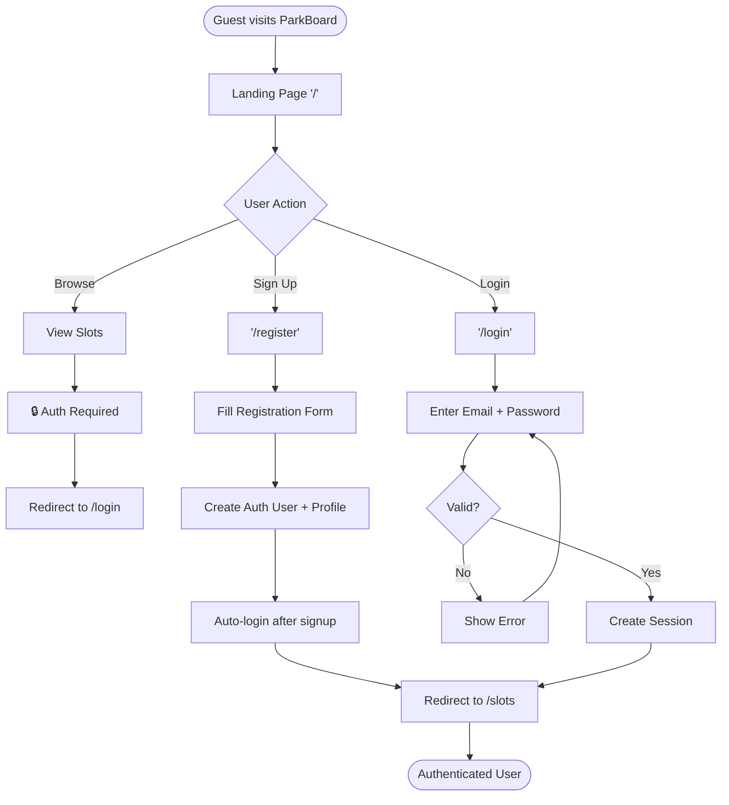
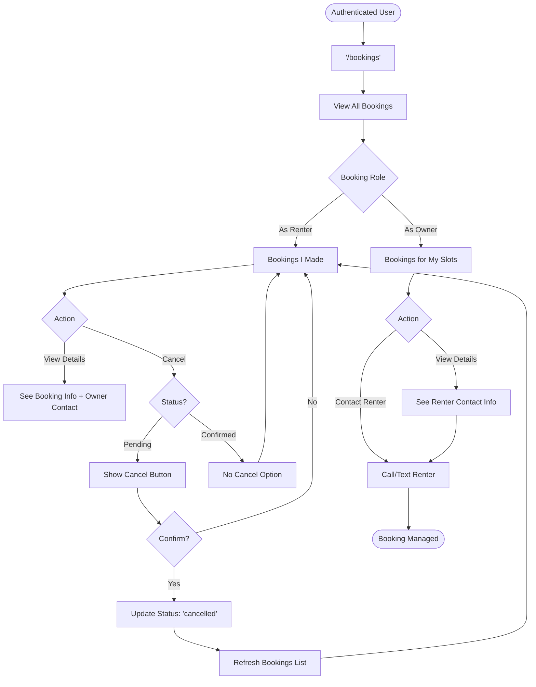

# ParkBoard - Comprehensive Sitemap & User Flows

**Generated:** 2025-10-07
**Version:** 1.0 (MVP + Planned Features)
**Branch:** `parkboard-mvp-optimized`

---

## Table of Contents

1. [Site Structure Overview](#site-structure-overview)
2. [Page Status Legend](#page-status-legend)
3. [Complete Sitemap](#complete-sitemap)
4. [User Flow Diagrams](#user-flow-diagrams)
5. [Primary User Journeys](#primary-user-journeys)
6. [Navigation Paths](#navigation-paths)
7. [Admin Routes (Planned)](#admin-routes-planned)

---

## Site Structure Overview

```
ParkBoard
├── 🟢 Public Pages (accessible to all)
├── 🟡 Auth Pages (login/register only)
├── 🔵 Protected Pages (authenticated users)
└── 🔴 Admin Pages (planned - Phase 2)
```

---

## Page Status Legend

| Symbol | Status | Description |
|--------|--------|-------------|
| ✅ | **LIVE** | Fully implemented and working |
| 🟡 | **READY** | Implemented, not in MVP scope |
| 🔵 | **PLANNED** | Phase 2 - Design ready, not implemented |
| 🔴 | **FUTURE** | Phase 3+ - Concept only |

---

## Complete Sitemap

### 🟢 Public Routes (Accessible to All)

```
/                                    ✅ Home / Landing Page
├── Hero Section
├── Features (For Renters, For Owners, Security)
├── Screenshots
├── Pricing Information
├── Testimonials
└── Footer with links

/about                               ✅ About Page
├── Mission & Vision
├── Problem We Solve
├── Our Solution
├── Why It's Free
├── Who We Are
└── Contact Information

/help                                ✅ Help / FAQ Page
├── Getting Started
├── For Renters
├── For Owners
├── Pricing & Payment
├── Security & Privacy
├── Troubleshooting
└── Contact Support
```

### 🟡 Authentication Routes

```
/login                               ✅ Login Page
├── Email Input
├── Password Input
├── Submit Button
└── Link to /register

/register                            ✅ Registration Page
├── Name Input
├── Email Input
├── Password Input
├── Phone Input
├── Unit Number Input
└── Submit Button (creates auth user + profile)

/auth/callback                       ✅ OAuth Callback Handler
└── (For future Google/Facebook login)

/profile/complete                    ✅ Profile Completion Page
└── (Edge case: auth user without profile)
```

### 🔵 Protected Routes (Authenticated Users Only)

#### Marketplace Routes

```
/slots                               ✅ Browse Parking Slots
├── Grid of available slots
├── Slot Cards showing:
│   ├── Slot Number
│   ├── Type (covered/uncovered/tandem)
│   ├── Price per Hour
│   ├── Description
│   └── Owner Name
├── Empty State (if no slots)
└── "List Your Slot" CTA

/slots/[slotId]                      ✅ Slot Detail & Booking Page
├── Slot Information (read-only)
│   ├── Slot Number
│   ├── Type
│   ├── Price
│   ├── Description
│   ├── Owner Name
│   └── Owner Phone
├── Booking Form
│   ├── Start Time (datetime-local)
│   ├── End Time (datetime-local)
│   └── Live Price Calculation
└── "Confirm Booking" Button

/slots/new                           ✅ List New Slot Page
├── Slot Number Input
├── Slot Type Dropdown
├── Description Textarea
├── Price per Hour Input
└── "List Slot" Button

/slots/edit/[slotId]                 🔵 Edit Slot Page (PLANNED - Phase 2)
├── Pre-filled form with existing data
├── Update Slot Number
├── Update Type
├── Update Description
├── Update Price
└── "Save Changes" Button
```

#### Booking Management Routes

```
/bookings                            ✅ My Bookings Page
├── List of User's Bookings (as renter)
├── List of Bookings for User's Slots (as owner)
├── Booking Cards showing:
│   ├── Booking ID
│   ├── Slot Number
│   ├── Start/End Time
│   ├── Total Price
│   ├── Status (pending/confirmed/completed/cancelled)
│   └── Owner/Renter Contact Info
├── "Cancel Booking" Button (pending only)
└── Empty State (if no bookings)

/bookings/[bookingId]                🔵 Booking Details Page (PLANNED - Phase 2)
├── Full Booking Information
├── Slot Details
├── Renter Information (if owner)
├── Owner Information (if renter)
├── Booking History/Timeline
└── Actions (Cancel, Contact, etc.)
```

#### User Dashboard Routes (🔵 PLANNED - Phase 2)

```
/dashboard                           🔵 User Dashboard (PLANNED)
├── Overview Cards
│   ├── My Active Bookings (count)
│   ├── My Slots Listed (count)
│   ├── Earnings This Month
│   └── Upcoming Bookings
├── Quick Actions
│   ├── Browse Slots
│   ├── List New Slot
│   └── View All Bookings
└── Recent Activity Feed

/dashboard/slots                     🔵 My Slots Management (PLANNED)
├── List of User's Slots
├── Slot Cards showing:
│   ├── Slot Number
│   ├── Status (active/inactive/maintenance)
│   ├── Current Bookings
│   └── Earnings (this month)
├── "Edit" Button → /slots/edit/[slotId]
├── "Mark Inactive" Button
└── "Add New Slot" CTA

/dashboard/bookings                  🔵 Booking Management (PLANNED)
├── Tabs: As Renter | As Owner
├── Filters: All | Active | Past | Cancelled
├── Sort: Date | Price | Status
└── Export Bookings (CSV)

/dashboard/earnings                  🔵 Earnings Dashboard (PLANNED)
├── Total Earnings (all time)
├── This Month Earnings
├── Chart: Earnings over time
├── Breakdown by Slot
└── Export Earnings (CSV)
```

#### Profile Routes (🔵 PLANNED - Phase 2)

```
/profile                             🔵 View Profile (PLANNED)
├── User Information
│   ├── Name
│   ├── Email
│   ├── Phone
│   └── Unit Number
├── Account Stats
│   ├── Member Since
│   ├── Total Bookings
│   └── Total Slots Listed
└── "Edit Profile" Button

/profile/edit                        🔵 Edit Profile (PLANNED)
├── Name Input
├── Phone Input
├── Password Change Section
└── "Save Changes" Button

/profile/settings                    🔵 Account Settings (PLANNED)
├── Email Notifications Toggle
├── SMS Notifications Toggle
├── Language Preference
└── "Logout" Button
```

#### Donations Routes (🔴 FUTURE - Phase 3)

```
/donations                           🔴 Donations Dashboard (FUTURE)
├── Overview
│   ├── Total Donations Made
│   ├── Total Received (if accepting)
│   └── Community Impact
├── Donation History
│   ├── Date
│   ├── Amount
│   ├── Recipient/Cause
│   └── Receipt
└── "Make a Donation" CTA

/donations/new                       🔴 Make a Donation (FUTURE)
├── Select Cause (dropdown)
├── Amount Input
├── Message (optional)
├── Payment Method
└── "Donate" Button

/donations/history                   🔴 Donation History (FUTURE)
├── List of all donations
├── Filters: Date Range, Cause
├── Download Receipts
└── Annual Summary
```

#### Ads Routes (🔴 FUTURE - Phase 3)

```
/ads                                 🔴 Community Bulletin Board (FUTURE)
├── Grid of Community Ads
│   ├── For Sale items
│   ├── Services offered
│   ├── Events
│   └── Announcements
├── Filters: Category, Date
└── "Post an Ad" Button

/ads/new                             🔴 Create Ad (FUTURE)
├── Category Dropdown
├── Title Input
├── Description Textarea
├── Images Upload
├── Contact Info
└── "Post Ad" Button

/ads/[adId]                          🔴 Ad Details (FUTURE)
├── Full Ad Information
├── Images Gallery
├── Poster Information
├── Contact Button
└── "Report" Button (if inappropriate)

/ads/my-ads                          🔴 My Ads (FUTURE)
├── List of User's Ads
├── Edit/Delete Actions
└── "Create New Ad" Button
```

### 🔴 Admin Routes (PLANNED - Phase 2+)

```
/admin                               🔴 Admin Dashboard (FUTURE)
├── Overview Stats
│   ├── Total Users
│   ├── Total Slots
│   ├── Total Bookings
│   └── Active Issues
├── Recent Activity
└── Quick Actions

/admin/users                         🔴 User Management (FUTURE)
├── User List (searchable, filterable)
├── User Details
│   ├── Name, Email, Phone, Unit
│   ├── Slots Listed
│   ├── Bookings Made
│   └── Reports/Flags
├── Actions
│   ├── Suspend User
│   ├── Delete User
│   └── Reset Password
└── Export Users (CSV)

/admin/users/[userId]                🔴 User Detail Page (FUTURE)
├── Full User Profile
├── Activity History
├── Bookings (as renter & owner)
├── Slots Listed
├── Reports/Complaints
└── Admin Actions

/admin/listings                      🔴 Slot Listings Management (FUTURE)
├── All Slots List
├── Filters: Status, Owner, Type
├── Actions
│   ├── View Details
│   ├── Mark Inactive
│   └── Delete (if violates policy)
└── Flagged Listings

/admin/listings/[slotId]             🔴 Listing Detail (Admin) (FUTURE)
├── Full Slot Information
├── Owner Information
├── Booking History
├── Reports/Flags
└── Admin Actions (suspend, delete)

/admin/bookings                      🔴 Bookings Management (FUTURE)
├── All Bookings List
├── Filters: Status, Date Range
├── Dispute Resolution
└── Export Bookings

/admin/reports                       🔴 Reports & Moderation (FUTURE)
├── User Reports
│   ├── Spam
│   ├── Inappropriate Content
│   ├── Fraud
│   └── Other
├── Report Details
│   ├── Reporter
│   ├── Reported User/Slot
│   ├── Description
│   └── Evidence
├── Actions
│   ├── Dismiss
│   ├── Warn User
│   ├── Suspend User
│   └── Delete Content
└── Report History

/admin/reports/[reportId]            🔴 Report Detail Page (FUTURE)
├── Full Report Information
├── Evidence (screenshots, messages)
├── Related Users/Content
├── Admin Notes
└── Resolution Actions

/admin/analytics                     🔴 Analytics Dashboard (FUTURE)
├── Usage Stats
│   ├── Daily/Weekly/Monthly Active Users
│   ├── Slots Listed Over Time
│   ├── Bookings Over Time
│   └── Revenue (if applicable)
├── Charts & Graphs
├── User Engagement Metrics
└── Export Reports

/admin/settings                      🔴 Admin Settings (FUTURE)
├── Platform Configuration
├── Email Templates
├── Notification Settings
├── Feature Flags
└── Maintenance Mode
```

---

## User Flow Diagrams

### Flow 1: Guest → Authenticated User



### Flow 2: Browse & Book Parking Slot (Primary Journey)

```mermaid
graph TD
    Start([Authenticated User]) --> Browse['/slots' - Browse Slots]

    Browse --> SlotList[View Available Slots]
    SlotList --> Filter{Filter/Search}
    Filter -->|Apply| FilterResults[Filtered Results]
    Filter -->|Skip| SlotList
    FilterResults --> SlotList

    SlotList --> SelectSlot[Click on Slot Card]
    SelectSlot --> SlotDetail['/slots/[id]' - Slot Detail]

    SlotDetail --> ViewInfo[View Slot Information]
    ViewInfo --> EnterTimes[Enter Start & End Time]
    EnterTimes --> PriceCalc[Live Price Calculation]
    PriceCalc --> Review[Review Booking Details]

    Review --> ConfirmChoice{Confirm Booking?}
    ConfirmChoice -->|No| Browse
    ConfirmChoice -->|Yes| SubmitBooking[Submit Booking]

    SubmitBooking --> Validate{Valid?}
    Validate -->|Overlap| ErrorMsg1[Error: Slot booked]
    Validate -->|Past Time| ErrorMsg2[Error: Time invalid]
    Validate -->|Other| ErrorMsg3[Show Error]
    ErrorMsg1 --> EnterTimes
    ErrorMsg2 --> EnterTimes
    ErrorMsg3 --> EnterTimes

    Validate -->|Success| CreateBooking[Create Booking in DB]
    CreateBooking --> Success[Show Success Message]
    Success --> Redirect[Redirect to /bookings]
    Redirect --> End([Booking Complete])
```

### Flow 3: List & Manage Parking Slot (Owner Journey)

```mermaid
graph TD
    Start([Authenticated User - Owner]) --> Landing[Landing Page or /slots]
    Landing --> ListCTA[Click "List Your Slot"]
    ListCTA --> NewSlot['/slots/new']

    NewSlot --> FillForm[Fill Slot Information]
    FillForm --> Fields{Enter Fields}
    Fields --> SlotNum[Slot Number]
    Fields --> Type[Slot Type]
    Fields --> Desc[Description]
    Fields --> Price[Price per Hour]

    SlotNum & Type & Desc & Price --> SubmitForm[Click "List Slot"]

    SubmitForm --> ValidateForm{Valid?}
    ValidateForm -->|Missing Fields| Error1[Error: Required field]
    ValidateForm -->|Invalid Price| Error2[Error: Price > 0]
    ValidateForm -->|Duplicate| Error3[Error: Slot exists]
    Error1 --> FillForm
    Error2 --> FillForm
    Error3 --> FillForm

    ValidateForm -->|Success| CreateSlot[Create Slot in DB]
    CreateSlot --> SetActive[Status: 'active']
    SetActive --> Success[Show Success]
    Success --> RedirectSlots[Redirect to /slots]

    RedirectSlots --> ViewListing[See Slot in Marketplace]
    ViewListing --> ManageOptions{Manage Slot}

    ManageOptions -->|View Bookings| Bookings['/bookings']
    ManageOptions -->|Edit Slot| EditPlanned[🔵 /slots/edit/[id] - Planned]
    ManageOptions -->|List Another| NewSlot

    Bookings --> ViewOwnerBookings[View Bookings for My Slots]
    ViewOwnerBookings --> ContactRenter[Contact Renter via Phone]
    ContactRenter --> End([Manage Complete])
```

### Flow 4: Manage Bookings (Renter + Owner)



### Flow 5: Profile Management (🔵 PLANNED)

```mermaid
graph TD
    Start([Authenticated User]) --> Nav[Navigation Menu]
    Nav --> Profile[Click "Profile"]
    Profile --> ViewProfile['/profile' - View Profile]

    ViewProfile --> ProfileInfo[Display User Information]
    ProfileInfo --> Actions{User Action}

    Actions -->|Edit| EditProfile['/profile/edit']
    Actions -->|Settings| Settings['/profile/settings']
    Actions -->|Logout| Logout[Sign Out]

    EditProfile --> EditForm[Edit Profile Form]
    EditForm --> UpdateFields[Update Name/Phone/Password]
    UpdateFields --> Save[Click "Save Changes"]
    Save --> ValidateEdit{Valid?}
    ValidateEdit -->|No| ShowError[Show Validation Error]
    ShowError --> EditForm
    ValidateEdit -->|Yes| UpdateDB[Update user_profiles]
    UpdateDB --> SuccessMsg[Show Success]
    SuccessMsg --> ViewProfile

    Settings --> SettingsPage[Notification Preferences]
    SettingsPage --> UpdateSettings[Toggle Email/SMS]
    UpdateSettings --> SaveSettings[Save Settings]
    SaveSettings --> ViewProfile

    Logout --> ClearSession[Clear Auth Session]
    ClearSession --> Redirect[Redirect to /login]
    Redirect --> End([User Logged Out])
```

### Flow 6: Donations Journey (🔴 FUTURE)

```mermaid
graph TD
    Start([Authenticated User]) --> Nav[Click "Donations" in Menu]
    Nav --> DonDash['/donations' - Donations Dashboard]

    DonDash --> ViewHistory[View Donation History]
    ViewHistory --> Actions{User Action}

    Actions -->|Make Donation| NewDon['/donations/new']
    Actions -->|View History| HistPage['/donations/history']

    NewDon --> SelectCause[Select Cause/Recipient]
    SelectCause --> EnterAmount[Enter Donation Amount]
    EnterAmount --> AddMessage[Optional Message]
    AddMessage --> SelectPayment[Select Payment Method]
    SelectPayment --> Review[Review Donation]
    Review --> ConfirmDon{Confirm?}
    ConfirmDon -->|No| DonDash
    ConfirmDon -->|Yes| ProcessPayment[Process Payment]
    ProcessPayment --> Success{Payment Success?}
    Success -->|No| ErrorPay[Payment Failed]
    ErrorPay --> NewDon
    Success -->|Yes| RecordDon[Record Donation in DB]
    RecordDon --> SendReceipt[Send Email Receipt]
    SendReceipt --> ThankYou[Show Thank You Page]
    ThankYou --> DonDash

    HistPage --> ListDonations[List All Donations]
    ListDonations --> FilterDon{Filter}
    FilterDon -->|Date| FilterDate[Filter by Date Range]
    FilterDon -->|Cause| FilterCause[Filter by Cause]
    FilterDon -->|None| ListDonations
    FilterDate --> ListDonations
    FilterCause --> ListDonations

    ListDonations --> DownloadReceipt[Download Receipt PDF]
    DownloadReceipt --> End([Donations Managed])
```

### Flow 7: Admin Moderation (🔴 FUTURE)

```mermaid
graph TD
    Start([Admin User]) --> AdminLogin[Login with Admin Role]
    AdminLogin --> AdminDash['/admin' - Admin Dashboard]

    AdminDash --> AdminNav{Navigate To}

    AdminNav -->|Users| UsersPage['/admin/users']
    AdminNav -->|Listings| ListingsPage['/admin/listings']
    AdminNav -->|Reports| ReportsPage['/admin/reports']
    AdminNav -->|Analytics| Analytics['/admin/analytics']

    UsersPage --> UserList[View All Users]
    UserList --> SearchUser[Search/Filter Users]
    SearchUser --> SelectUser[Select User]
    SelectUser --> UserDetail['/admin/users/[id]']
    UserDetail --> UserActions{Admin Action}
    UserActions -->|Suspend| SuspendUser[Suspend Account]
    UserActions -->|Delete| DeleteUser[Delete Account]
    UserActions -->|Reset PW| ResetPW[Send Password Reset]

    ListingsPage --> SlotList[View All Listings]
    SlotList --> FlaggedSlots{Filter}
    FlaggedSlots -->|Flagged| ViewFlagged[Flagged Listings Only]
    FlaggedSlots -->|All| SlotList
    ViewFlagged --> ReviewSlot[Review Slot Details]
    ReviewSlot --> SlotActions{Action}
    SlotActions -->|Approve| ApproveSlot[Mark as Approved]
    SlotActions -->|Remove| RemoveSlot[Delete Listing]
    SlotActions -->|Warn| WarnOwner[Send Warning to Owner]

    ReportsPage --> ReportList[View All Reports]
    ReportList --> PendingReports{Status Filter}
    PendingReports -->|Pending| ShowPending[Pending Reports Only]
    PendingReports -->|All| ReportList
    ShowPending --> SelectReport[Select Report]
    SelectReport --> ReportDetail['/admin/reports/[id]']
    ReportDetail --> ReviewReport[Review Evidence]
    ReviewReport --> ReportActions{Admin Action}
    ReportActions -->|Dismiss| DismissReport[Dismiss Report]
    ReportActions -->|Warn User| WarnReported[Send Warning]
    ReportActions -->|Suspend| SuspendReported[Suspend User]
    ReportActions -->|Delete| DeleteContent[Delete Content]

    DismissReport & WarnReported & SuspendReported & DeleteContent --> UpdateReport[Update Report Status]
    UpdateReport --> ReportsPage

    Analytics --> ViewStats[View Platform Statistics]
    ViewStats --> ExportData[Export Analytics Data]
    ExportData --> End([Admin Task Complete])
```

---

## Primary User Journeys

### Journey 1: First-Time User Registration → First Booking

**User Type:** Guest → Renter
**Goal:** Register and book a parking slot
**Steps:** 9

```
1. Guest lands on / (Home)
2. Clicks "Sign Up"
3. Fills registration form (/register)
   - Name: John Doe
   - Email: john@example.com
   - Password: ********
   - Phone: +639171234567
   - Unit: 12A
4. Submits → Account created
5. Auto-redirected to /slots (authenticated)
6. Browses available slots
7. Clicks on Slot A-10
8. Enters booking time (Tomorrow 9AM-5PM)
9. Confirms booking → Redirected to /bookings

Result: User registered + First booking made
Time: ~5 minutes
```

### Journey 2: Slot Owner Listing First Slot

**User Type:** Authenticated User → Owner
**Goal:** List a parking slot for rent
**Steps:** 7

```
1. User logs in (/login)
2. Navigates to / or /slots
3. Clicks "List Your Slot"
4. Fills slot form (/slots/new)
   - Slot Number: B-05
   - Type: Covered
   - Description: "Near elevator, well-lit"
   - Price: ₱50/hour
5. Submits → Slot created
6. Redirected to /slots
7. Sees their slot in marketplace

Result: Slot listed and visible to all users
Time: ~3 minutes
```

### Journey 3: Managing Bookings as Owner

**User Type:** Slot Owner
**Goal:** View bookings for owned slots and contact renters
**Steps:** 5

```
1. Owner logs in
2. Navigates to /bookings
3. Sees "My Bookings" with two sections:
   - As Renter (slots I booked)
   - As Owner (bookings for my slots)
4. Reviews booking for their Slot B-05
   - Renter: John Doe
   - Time: Tomorrow 9AM-5PM
   - Phone: +639171234567
   - Price: ₱400
5. Calls/texts renter to coordinate

Result: Owner contacts renter for coordination
Time: ~2 minutes
```

### Journey 4: Cancelling a Booking

**User Type:** Renter
**Goal:** Cancel a pending booking
**Steps:** 4

```
1. Renter logs in
2. Navigates to /bookings
3. Finds booking with status "PENDING"
4. Clicks "Cancel Booking"
5. Confirms in browser dialog
6. Booking status changes to "CANCELLED"

Result: Booking cancelled, slot becomes available
Time: ~1 minute
```

### Journey 5: Returning User Quick Book

**User Type:** Returning Renter
**Goal:** Quickly book a familiar slot
**Steps:** 4

```
1. User logs in (/login)
2. Auto-redirected to /slots
3. Clicks on favorite slot (e.g., Slot A-10)
4. Enters time → Confirms booking

Result: Booked in <2 minutes
Time: ~1-2 minutes
```

---

## Navigation Paths

### Path 1: Unauthenticated User Navigation

```
HOME (/)
├── About (/about)
├── Help (/help)
├── Login (/login)
│   └── [Success] → /slots (authenticated)
└── Sign Up (/register)
    └── [Success] → /slots (authenticated)

ANY PROTECTED ROUTE (e.g., /slots, /bookings)
└── [Unauthenticated] → Redirect to /login
```

### Path 2: Authenticated User Navigation (Current MVP)

```
HOME (/) [Logged In]
└── Navigation Shows: Browse Slots | List My Slot | My Bookings | Sign Out

BROWSE SLOTS (/slots)
├── View all active slots
├── Click slot → /slots/[id] (book)
└── Click "List Your Slot" → /slots/new

SLOT DETAIL (/slots/[id])
├── View slot information
├── Enter booking times
├── Confirm booking → /bookings
└── Cancel → /slots

LIST NEW SLOT (/slots/new)
├── Fill form
├── Submit → /slots (see new listing)
└── Cancel → /slots

MY BOOKINGS (/bookings)
├── View bookings (as renter & owner)
├── Cancel pending bookings (renter only)
└── Contact owner/renter via phone

ANY PAGE
└── Click "Sign Out" → /login (session cleared)
```

### Path 3: Future Navigation (Phase 2 - With Dashboard)

```
HOME (/) [Logged In]
└── Navigation: Dashboard | Browse | List Slot | Profile

DASHBOARD (/dashboard)
├── Overview Cards
├── Quick Actions
│   ├── Browse Slots → /slots
│   ├── List Slot → /slots/new
│   └── View Bookings → /dashboard/bookings
└── My Slots → /dashboard/slots

DASHBOARD MENU
├── My Slots (/dashboard/slots)
│   ├── View all owned slots
│   ├── Edit slot → /slots/edit/[id]
│   └── Add slot → /slots/new
├── Bookings (/dashboard/bookings)
│   ├── Filter: As Renter | As Owner
│   ├── View booking details → /bookings/[id]
│   └── Export bookings (CSV)
├── Earnings (/dashboard/earnings)
│   └── View earnings charts
└── Profile (/profile)
    ├── View profile info
    ├── Edit → /profile/edit
    └── Settings → /profile/settings
```

### Path 4: Admin Navigation (Planned)

```
ADMIN DASHBOARD (/admin)
└── Admin Menu

ADMIN MENU
├── Users (/admin/users)
│   ├── User list
│   ├── Search/filter
│   └── User detail → /admin/users/[id]
│       ├── View activity
│       └── Admin actions (suspend/delete)
├── Listings (/admin/listings)
│   ├── All slots
│   ├── Flagged slots
│   └── Slot detail → /admin/listings/[id]
│       └── Admin actions (approve/remove)
├── Bookings (/admin/bookings)
│   ├── All bookings
│   └── Dispute resolution
├── Reports (/admin/reports)
│   ├── Pending reports
│   ├── Report detail → /admin/reports/[id]
│   └── Admin actions (dismiss/warn/suspend)
├── Analytics (/admin/analytics)
│   ├── Usage stats
│   └── Export reports
└── Settings (/admin/settings)
    └── Platform configuration
```

---

## Feature Comparison by User Type

### Guest (Unauthenticated)

| Feature | Access | Notes |
|---------|--------|-------|
| View Landing Page | ✅ Yes | Public |
| View About | ✅ Yes | Public |
| View Help/FAQ | ✅ Yes | Public |
| Browse Slots | ❌ No | Requires auth |
| Register | ✅ Yes | Creates account |
| Login | ✅ Yes | Authenticates |

### Authenticated User (Renter)

| Feature | Access | Notes |
|---------|--------|-------|
| Browse Slots | ✅ Yes | Main marketplace |
| Book Slot | ✅ Yes | Create booking |
| View My Bookings | ✅ Yes | See own bookings |
| Cancel Booking | ✅ Yes | Pending only |
| List Slot | ✅ Yes | Become owner |
| Edit Profile | 🔵 Planned | Phase 2 |

### Authenticated User (Owner)

| Feature | Access | Notes |
|---------|--------|-------|
| All Renter Features | ✅ Yes | Can also rent |
| List Slot | ✅ Yes | Add to marketplace |
| View Slot Bookings | ✅ Yes | See who booked |
| Edit Slot | 🔵 Planned | Phase 2 |
| Earnings Dashboard | 🔵 Planned | Phase 2 |
| Mark Slot Inactive | 🔵 Planned | Phase 2 |

### Admin (Moderator)

| Feature | Access | Notes |
|---------|--------|-------|
| All User Features | ✅ Yes | Can use app normally |
| View All Users | 🔴 Planned | Admin panel |
| Suspend/Delete Users | 🔴 Planned | Moderation |
| View All Listings | 🔴 Planned | Admin panel |
| Remove Listings | 🔴 Planned | Policy violations |
| View Reports | 🔴 Planned | User reports |
| Resolve Disputes | 🔴 Planned | Mediation |
| View Analytics | 🔴 Planned | Platform stats |

---

## Page Interconnections

### Hub Pages (Most Connected)

1. **/ (Home)** → Connects to: Login, Register, About, Help, Slots, List Slot
2. **/slots** → Connects to: Slot Detail, New Slot, Bookings, Home
3. **/bookings** → Connects to: Slots, Slot Detail (via slot link)

### Terminal Pages (Least Connected)

1. **/about** → Only connects back to Home/Help
2. **/help** → Only connects back to Home/About
3. **/slots/[id]** → Either books (→ /bookings) or goes back (→ /slots)

---

## Roadmap Summary

### ✅ Phase 1: MVP (Current - LIVE)

- Landing page with branding
- Authentication (login/register)
- Browse parking slots marketplace
- Book slots by time
- List new slots
- View/manage bookings
- Cancel pending bookings
- About & Help pages

### 🔵 Phase 2: Enhanced Features (Q1 2025)

- User dashboard
- Edit slot functionality
- Edit profile
- Email notifications
- Advanced search/filters
- Booking details page
- Earnings dashboard
- Account settings
- Mobile responsive improvements

### 🔴 Phase 3: Community Features (Q2 2025)

- Donations system
- Community bulletin board (ads)
- Admin moderation panel
- Analytics dashboard
- Advanced reporting
- Mobile apps (iOS/Android)
- Payment integration
- Email verification

### Future Considerations

- Multi-language support
- Multi-building support
- API for third-party integrations
- Scheduled bookings (recurring)
- Slot reviews/ratings
- In-app messaging

---

## Summary Statistics

| Metric | Count | Status |
|--------|-------|--------|
| **Total Pages** | 35 | 10 live, 25 planned |
| **Public Routes** | 5 | 100% complete |
| **Auth Routes** | 4 | 100% complete |
| **Protected Routes (MVP)** | 5 | 100% complete |
| **Protected Routes (Phase 2)** | 12 | 0% complete |
| **Admin Routes** | 9 | 0% complete |
| **Primary User Journeys** | 7 | 5 live, 2 planned |
| **User Types** | 4 | Guest, User, Owner, Admin |

---

**End of Sitemap & User Flows Document**

*For implementation details, see:*
- *Technical specs: `docs/pseudocode_20251007-090752.md`*
- *Testing: `docs/tests_20251007-090752.md`*
- *Audit results: `docs/AUDIT_REPORT_20251007.md`*
