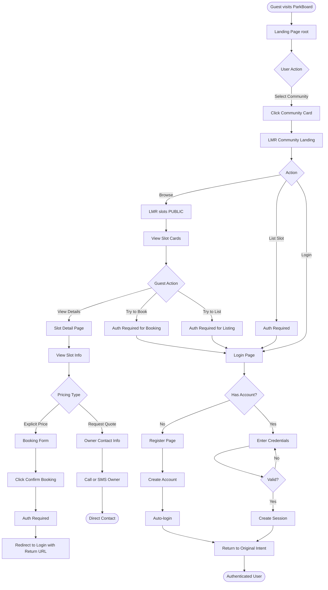
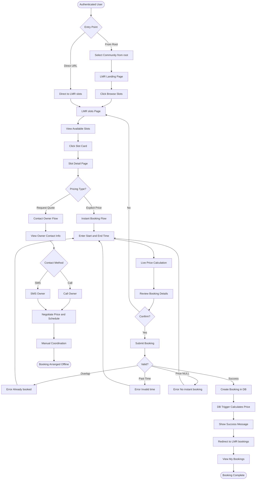
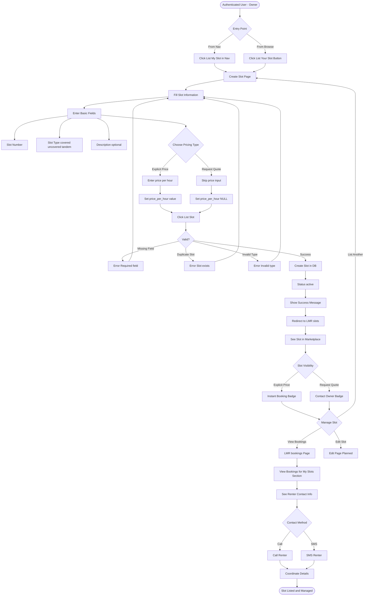
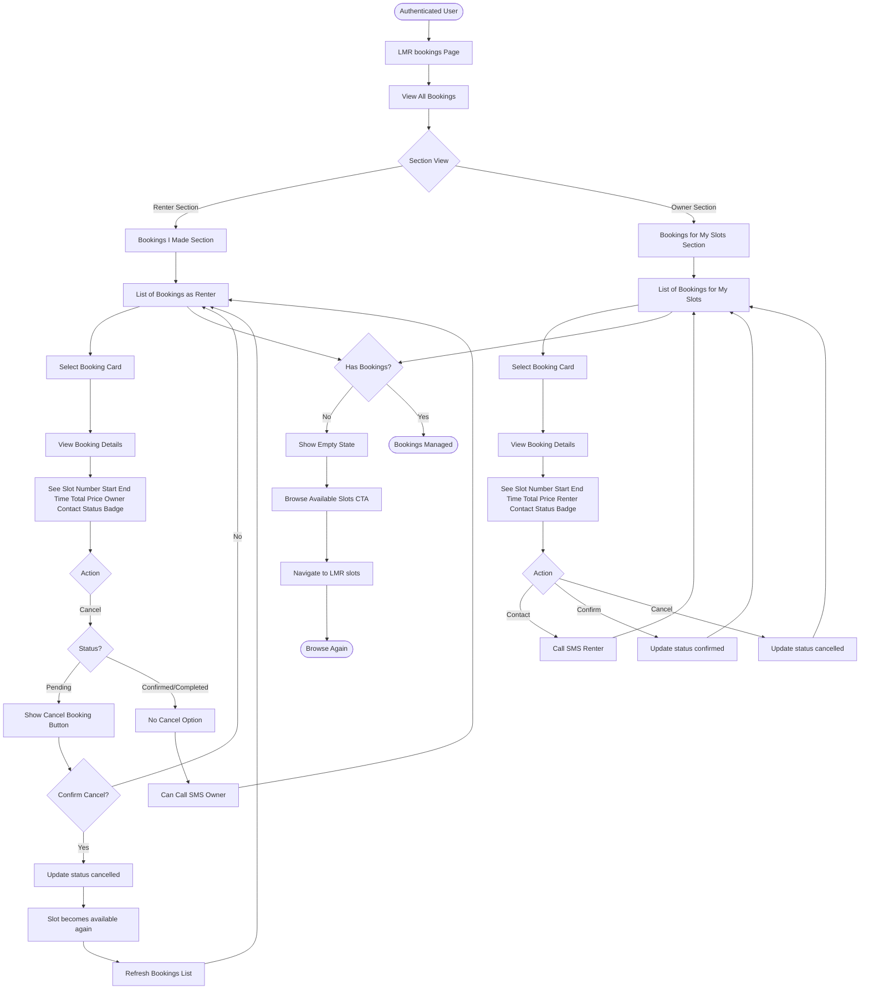

# ParkBoard - Sitemap & User Flows (Multi-Tenant Architecture)

**Generated:** 2025-10-14
**Version:** 2.0 (Multi-Tenant MVP)
**Branch:** `parkboard-mvp-optimized`
**Previous Version:** `SITEMAP_AND_USER_FLOWS_20251009.md`

---

## 🆕 What's New in Version 2.0

### Multi-Tenant Architecture (2025-10-14)
- **Path-based community routing:** `/LMR/slots`, `/SRP/slots`, `/BGC/slots`
- **Community-specific branding:** Each community has its own landing page
- **Public browsing enabled:** Browse slots without login (actions require auth)
- **Community data isolation:** RLS policies filter by `community_code`
- **Organic community codes:** LMR (Lumiere), SRP (Serendra), BGC, etc.

### Key Changes from v1.0
1. ✅ **All marketplace routes now under `/[community]/*`**
2. ✅ **Public slot browsing** - No login required to view listings
3. ✅ **Community selector** - Root page shows available communities
4. ✅ **Community landing pages** - `/LMR` intro page for each community
5. ✅ **Navigation updates** - Shows Login/Register for guests, profile for authenticated

---

## Table of Contents

1. [Site Structure Overview](#site-structure-overview)
2. [Page Status Legend](#page-status-legend)
3. [Complete Sitemap](#complete-sitemap)
4. [Multi-Tenant URL Structure](#multi-tenant-url-structure)
5. [User Flow Diagrams](#user-flow-diagrams)
6. [Primary User Journeys](#primary-user-journeys)
7. [Navigation Paths](#navigation-paths)
8. [Public vs Protected Routes](#public-vs-protected-routes)

---

## Site Structure Overview

```
ParkBoard (Multi-Tenant)
├── 🟢 Public Pages (accessible to all, no login)
│   ├── Root landing page with community selector
│   ├── Community landing pages (/LMR, /SRP, etc.)
│   └── Browse slots pages (/LMR/slots, /SRP/slots)
├── 🟡 Auth Pages (login/register only)
├── 🔵 Protected Pages (authenticated users, actions only)
│   ├── Create slots (List My Slot)
│   ├── Book slots (Booking form submission)
│   └── View bookings (My Bookings)
└── 🔴 Admin Pages (planned - Phase 2)
```

### Architecture Pattern

**Multi-Tenant Isolation:**
- Each community has isolated data (RLS by `community_code`)
- Users belong to one community (stored in `user_profiles.community_code`)
- Slots belong to one community (stored in `parking_slots.community_code`)
- Bookings inherit community from slot

**URL Structure:**
```
parkboard.app/                    # Community selector
parkboard.app/LMR                 # Lumiere landing page
parkboard.app/LMR/slots           # Browse Lumiere slots (PUBLIC)
parkboard.app/LMR/slots/new       # List slot (AUTH REQUIRED)
parkboard.app/LMR/slots/[id]      # Slot detail + booking (PUBLIC view, AUTH to book)
parkboard.app/LMR/bookings        # My bookings (AUTH REQUIRED)
```

---

## Page Status Legend

| Symbol | Status | Description |
|--------|--------|-------------|
| ✅ | **LIVE** | Fully implemented and working (as of 2025-10-14) |
| 🟡 | **READY** | Implemented, not in MVP scope |
| 🔵 | **PLANNED** | Phase 2 - Design ready, not implemented |
| 🔴 | **FUTURE** | Phase 3+ - Concept only |

---

## Complete Sitemap

### 🟢 Public Routes (Accessible to All - No Login Required)

#### Root & Community Pages

```
/                                    ✅ Community Selector Landing
├── Hero Section ("Welcome to ParkBoard")
├── Community Cards (LMR, SRP, BGC...)
│   ├── Community Name & Display Name
│   ├── Description
│   └── "Browse Slots" CTA → /[community]
└── Footer (About, Help, Login, Register)

/[community]                         ✅ Community Landing Page (e.g., /LMR)
├── Community Hero ("Welcome to Lumiere Residences ParkBoard")
├── Features
│   ├── For Renters (Find parking)
│   ├── For Owners (Earn passive income)
│   └── Community Benefits
├── Quick Actions
│   ├── "Browse Slots" → /[community]/slots
│   ├── "List My Slot" → /[community]/slots/new (requires auth)
│   └── "Login" / "Register" (if not authenticated)
└── Community Stats (# of slots, # of users, etc.)

/[community]/slots                   ✅ Browse Parking Slots (PUBLIC)
├── Navigation Bar
│   ├── ParkBoard Logo → /[community]
│   ├── Browse Slots (current)
│   ├── List My Slot → /[community]/slots/new
│   ├── My Bookings → /[community]/bookings
│   └── Login/Register (if guest) OR Profile + Sign Out (if authenticated)
├── Page Title ("Available Parking Slots")
├── "List Your Slot" Button (top right)
├── Slot Grid (3 columns on desktop, 1 on mobile)
│   ├── Slot Cards showing:
│   │   ├── Slot Number (e.g., "Slot A-101")
│   │   ├── Slot Type (covered/uncovered/tandem)
│   │   ├── Price per Hour OR "Request Quote"
│   │   ├── Badge: "✓ Instant Booking" OR "Contact Owner"
│   │   ├── Description (truncated)
│   │   ├── Owner Name
│   │   └── Button: "Book Now" OR "View Details"
│   └── Empty State (if no slots)
│       ├── "No slots available yet"
│       └── "Be the first to list one!" CTA
└── Filtering (🔵 Planned Phase 2)

/[community]/slots/[slotId]          ✅ Slot Detail & Booking (PUBLIC view, AUTH to book)
├── Navigation Bar (same as above)
├── Slot Information Card
│   ├── Slot Number
│   ├── Slot Type
│   ├── Description
│   ├── Price per Hour OR "Price on Request"
│   └── Owner Contact (name, phone)
├── CONDITIONAL RENDERING based on pricing:
│   ├── IF price_per_hour IS NOT NULL (Explicit Pricing):
│   │   ├── Booking Form (requires auth to submit)
│   │   │   ├── Start Time (datetime-local)
│   │   │   ├── End Time (datetime-local)
│   │   │   ├── Live Price Calculation
│   │   │   └── "Confirm Booking" Button
│   │   └── If not authenticated: Button shows "Login to Book"
│   └── IF price_per_hour IS NULL (Request Quote):
│       ├── Info Alert: "Request Quote Required"
│       ├── Owner Contact Card
│       │   ├── Owner Name
│       │   ├── Owner Phone
│       │   ├── "📞 Call Owner" Button
│       │   └── "💬 Send SMS" Button
│       └── "← Back to Slot Listings" Button
└── "Cancel" Button → /[community]/slots

/about                               ✅ About Page (Global, not community-specific)
├── Mission & Vision
├── Problem We Solve
├── Our Solution
├── Why It's Free
├── Who We Are
└── Contact Information

/help                                ✅ Help / FAQ Page (Global)
├── Getting Started
├── For Renters
├── For Owners
├── Community-Specific Questions
├── Pricing & Payment
├── Security & Privacy
└── Contact Support
```

### 🟡 Authentication Routes (Login/Register Only)

```
/login                               ✅ Login Page
├── Email Input
├── Password Input
├── Submit Button
├── Link to /register
└── Redirect to / after login (user selects community)

/register                            ✅ Registration Page
├── Name Input
├── Email Input
├── Password Input
├── Phone Input
├── Unit Number Input
├── Community Selection (hidden - defaults to LMR for now)
└── Submit Button (creates auth user + profile)
    └── Redirect to / after registration

/auth/callback                       ✅ OAuth Callback Handler
└── (For future Google/Facebook login)

/profile/complete                    ✅ Profile Completion Page
└── (Edge case: auth user without profile)
```

### 🔵 Protected Routes (Authenticated Users Only - Actions Require Login)

#### Marketplace Routes (Multi-Tenant)

```
/[community]/slots/new               ✅ List New Slot Page (AUTH REQUIRED)
├── Navigation Bar
├── Form Title ("List Your Parking Slot")
├── Slot Number Input
├── Slot Type Dropdown (covered/uncovered/tandem)
├── Description Textarea
├── Pricing Type Radio Buttons: ✅ NEW - Hybrid Pricing
│   ├── Option 1: "Set Explicit Price" (₱X/hour)
│   │   └── Shows: Price per Hour Input
│   └── Option 2: "Request Quote" (Contact owner for pricing)
│       └── Hides price input, sets price_per_hour = NULL
├── "List Slot" Button
└── "Cancel" Button → /[community]/slots

/[community]/slots/edit/[slotId]     🔵 Edit Slot Page (PLANNED - Phase 2)
├── Pre-filled form with existing data
├── Update Slot Number
├── Update Type
├── Update Description
├── Update Pricing (explicit or request quote)
└── "Save Changes" Button

/[community]/bookings                ✅ My Bookings Page (AUTH REQUIRED)
├── Navigation Bar
├── Page Title ("My Bookings")
├── Booking Cards List
│   ├── Booking Information:
│   │   ├── Booking ID
│   │   ├── Slot Number (link to slot detail)
│   │   ├── Start Time
│   │   ├── End Time
│   │   ├── Total Price
│   │   ├── Status Badge (pending/confirmed/cancelled/completed)
│   │   └── Owner/Renter Contact Info
│   ├── Actions:
│   │   └── "Cancel Booking" Button (pending only)
│   └── Two Sections:
│       ├── Bookings I Made (as renter)
│       └── Bookings for My Slots (as owner)
├── Empty State (if no bookings)
│   ├── "You haven't made any bookings yet"
│   └── "Browse Available Slots" CTA
└── Filtering/Sorting (🔵 Planned Phase 2)

/[community]/bookings/[bookingId]    🔵 Booking Details Page (PLANNED - Phase 2)
├── Full Booking Information
├── Slot Details
├── Renter Information (if owner viewing)
├── Owner Information (if renter viewing)
├── Booking History/Timeline
└── Actions (Cancel, Contact, etc.)
```

#### User Dashboard Routes (🔵 PLANNED - Phase 2)

```
/dashboard                           🔵 User Dashboard (PLANNED)
├── Community Badge (shows user's community)
├── Overview Cards
│   ├── My Active Bookings (count)
│   ├── My Slots Listed (count)
│   ├── Earnings This Month
│   └── Upcoming Bookings
├── Quick Actions
│   ├── Browse Slots → /[community]/slots
│   ├── List New Slot → /[community]/slots/new
│   └── View All Bookings → /[community]/bookings
└── Recent Activity Feed

/dashboard/slots                     🔵 My Slots Management (PLANNED)
├── List of User's Slots (community-filtered)
├── Slot Cards showing:
│   ├── Slot Number
│   ├── Status (active/inactive/maintenance)
│   ├── Current Bookings
│   ├── Pricing Type (Explicit or Request Quote)
│   └── Earnings (this month)
├── Actions:
│   ├── "Edit" → /[community]/slots/edit/[slotId]
│   ├── "Mark Inactive"
│   └── "View Bookings" → filtered /[community]/bookings
└── "Add New Slot" CTA

/dashboard/bookings                  🔵 Booking Management (PLANNED)
├── Tabs: As Renter | As Owner
├── Filters: All | Active | Past | Cancelled
├── Community Filter (if user has multi-community access - future)
├── Sort: Date | Price | Status
└── Export Bookings (CSV)

/dashboard/earnings                  🔵 Earnings Dashboard (PLANNED)
├── Total Earnings (all time, community-specific)
├── This Month Earnings
├── Chart: Earnings over time
├── Breakdown by Slot
└── Export Earnings (CSV)
```

#### Profile Routes (🔵 PLANNED - Phase 2)

```
/profile                             🔵 View Profile (PLANNED)
├── User Information
│   ├── Name
│   ├── Email
│   ├── Phone
│   ├── Unit Number
│   └── Community (read-only for now)
├── Account Stats
│   ├── Member Since
│   ├── Total Bookings
│   └── Total Slots Listed
└── "Edit Profile" Button

/profile/edit                        🔵 Edit Profile (PLANNED)
├── Name Input
├── Phone Input
├── Password Change Section
├── Community (read-only - no multi-community yet)
└── "Save Changes" Button

/profile/settings                    🔵 Account Settings (PLANNED)
├── Email Notifications Toggle
├── SMS Notifications Toggle
├── Language Preference
└── "Logout" Button
```

### 🔴 Admin Routes (PLANNED - Phase 2+)

```
/admin                               🔴 Admin Dashboard (FUTURE)
├── Multi-Community Overview
│   ├── Stats per Community (LMR, SRP, BGC)
│   ├── Total Users by Community
│   ├── Total Slots by Community
│   └── Active Bookings by Community
├── Recent Activity (all communities)
└── Quick Actions

/admin/communities                   🔴 Community Management (FUTURE)
├── Community List
│   ├── Community Code
│   ├── Name & Display Name
│   ├── Status (active/inactive)
│   ├── User Count
│   └── Slot Count
├── Actions:
│   ├── "Add New Community"
│   ├── "Edit Community"
│   ├── "Deactivate Community"
│   └── "View Community Details"
└── Community Settings:
    ├── Branding (colors, logo)
    ├── Features (enable/disable features per community)
    └── Rules (community-specific policies)

/admin/communities/[code]            🔴 Community Detail Page (FUTURE)
├── Community Information
├── Community Stats
├── Users in Community
├── Slots in Community
├── Bookings in Community
└── Admin Actions

/admin/users                         🔴 User Management (FUTURE)
├── User List (all communities, filterable)
│   ├── Name, Email, Community
│   ├── Slots Listed
│   ├── Bookings Made
│   └── Reports/Flags
├── Filter by Community
├── Actions:
│   ├── Suspend User
│   ├── Delete User
│   └── Reset Password
└── Export Users (CSV)

/admin/listings                      🔴 Slot Listings Management (FUTURE)
├── All Slots List (all communities)
├── Filter by Community
├── Filters: Status, Owner, Type, Pricing Type
├── Actions:
│   ├── View Details
│   ├── Mark Inactive
│   └── Delete (if violates policy)
└── Flagged Listings

/admin/bookings                      🔴 Bookings Management (FUTURE)
├── All Bookings (all communities)
├── Filter by Community
├── Filters: Status, Date Range
├── Dispute Resolution
└── Export Bookings

/admin/reports                       🔴 Reports & Moderation (FUTURE)
├── User Reports (all communities)
├── Filter by Community
├── Report Types: Spam, Fraud, Inappropriate, Other
└── Actions: Dismiss, Warn, Suspend, Delete

/admin/analytics                     🔴 Analytics Dashboard (FUTURE)
├── Platform-Wide Analytics
├── Per-Community Analytics
│   ├── User Growth by Community
│   ├── Slot Listings by Community
│   ├── Booking Volume by Community
│   └── Revenue by Community (if applicable)
├── Comparative Charts (community vs community)
└── Export Reports
```

---

## Multi-Tenant URL Structure

### URL Pattern

```
parkboard.app/[COMMUNITY_CODE]/[feature]/[resource]
              └─────┬──────┘   └────┬───┘  └───┬──┘
                    │                │          │
              2-4 letters       marketplace   specific
              uppercase         feature       item ID
```

### Examples

| URL | Community | Feature | Resource | Access Level |
|-----|-----------|---------|----------|--------------|
| `/` | N/A | Root | Community Selector | 🟢 Public |
| `/LMR` | Lumiere | Landing | Community Home | 🟢 Public |
| `/LMR/slots` | Lumiere | Browse | Slot Listing | 🟢 Public |
| `/LMR/slots/123` | Lumiere | Slot Detail | Slot ID 123 | 🟢 Public (view), 🔵 Auth (book) |
| `/LMR/slots/new` | Lumiere | Create Slot | New | 🔵 Auth Required |
| `/LMR/bookings` | Lumiere | My Bookings | User's Bookings | 🔵 Auth Required |
| `/SRP/slots` | Serendra | Browse | Slot Listing | 🟢 Public |
| `/BGC/slots/new` | BGC | Create Slot | New | 🔵 Auth Required |

### Community Codes

| Code | Community Name | Display Name | Status |
|------|----------------|--------------|--------|
| `LMR` | Lumiere | Lumiere Residences | ✅ Live |
| `SRP` | Serendra | Serendra | 🔵 Planned |
| `BGC` | BGC | Bonifacio Global City | 🔵 Planned |
| `SMDC` | SMDC | SM Development Corporation Properties | 🔴 Future |

**Community Code Standards:**
- **Length:** 2-4 uppercase letters
- **Source:** Organic (from resident groups, not top-down assigned)
- **Uniqueness:** Each code must be unique
- **Validation:** Hardcoded in middleware (will be database-driven in Phase 2)

---

## User Flow Diagrams

### Flow 1: Guest → Browse Slots (Multi-Tenant) 🆕



### Flow 2: Authenticated User → Book Parking Slot (Multi-Tenant)



### Flow 3: List & Manage Parking Slot (Owner Journey - Multi-Tenant)



### Flow 4: Manage Bookings (Renter + Owner - Multi-Tenant)



---

## Primary User Journeys

### Journey 1: First-Time User → Browse Without Account (🆕 Multi-Tenant)

**User Type:** Guest
**Goal:** Browse parking slots without creating account
**Steps:** 5
**NEW:** Public browsing enabled in v2.0

```
1. Guest lands on / (Community Selector)
2. Clicks "Lumiere Residences" community card
3. Lands on /LMR (Lumiere landing page)
4. Clicks "Browse Slots"
5. Views /LMR/slots marketplace
   - Sees 10 available slots
   - Can view slot details
   - Cannot book without login
6. Clicks on a slot to view details
7. Sees "Login to Book" button

Result: User can browse publicly, encouraged to register
Time: ~2 minutes
Auth Required: NO ✅ (Changed from v1.0)
```

### Journey 2: First-Time User Registration → First Booking (Multi-Tenant)

**User Type:** Guest → Authenticated Renter
**Goal:** Register and book a parking slot in specific community
**Steps:** 10
**UPDATED:** Multi-tenant URLs

```
1. Guest lands on / (Community Selector)
2. Browses /LMR/slots (public)
3. Finds desired slot
4. Clicks "Login to Book"
5. Redirected to /login?redirect=/LMR/slots/123
6. Clicks "Don't have an account? Register"
7. Fills registration form (/register)
   - Name: John Doe
   - Email: john@example.com
   - Password: ********
   - Phone: +639171234567
   - Unit: 12A
   - Community: LMR (auto-set based on redirect)
8. Submits → Account created
9. Auto-logged in, redirected back to /LMR/slots/123
10. Enters booking time (Tomorrow 9AM-5PM)
11. Confirms booking → Redirected to /LMR/bookings

Result: User registered + First booking made in LMR community
Time: ~5 minutes
Community: Lumiere (LMR)
```

### Journey 3: Slot Owner Listing with Hybrid Pricing (🆕 Multi-Tenant + Hybrid Pricing)

**User Type:** Authenticated User → Owner
**Goal:** List a parking slot with pricing choice
**Steps:** 8
**NEW:** Hybrid pricing options

```
1. User logs in (/login)
2. Lands on / (Community Selector)
3. Selects their community (LMR)
4. Clicks "List Your Slot" from /LMR or nav bar
5. Navigates to /LMR/slots/new
6. Fills slot form:
   - Slot Number: B-05
   - Type: Covered
   - Description: "Near elevator, well-lit"
   - PRICING CHOICE:
     Option A: Set Explicit Price → ₱50/hour (Instant Booking)
     Option B: Request Quote → NULL price (Contact Owner)
7. Chooses Option A (Explicit Price: ₱50/hour)
8. Submits → Slot created
9. Redirected to /LMR/slots
10. Sees their slot with "✓ Instant Booking" badge

Result: Slot listed with explicit pricing in LMR marketplace
Time: ~3 minutes
Pricing: Explicit (₱50/hour)
```

### Journey 4: Slot Owner Listing with Request Quote (🆕 Hybrid Pricing)

**User Type:** Authenticated User → Owner
**Goal:** List a parking slot for manual pricing negotiation
**Steps:** 8
**NEW:** Request Quote pricing option

```
1. User logs in and navigates to /LMR/slots/new
2. Fills slot form:
   - Slot Number: C-12
   - Type: Tandem
   - Description: "2 cars, tight fit, experienced drivers only"
   - PRICING CHOICE:
     Option A: Set Explicit Price
     Option B: Request Quote ← Selects this
3. Price input hidden, price_per_hour set to NULL
4. Submits → Slot created
5. Redirected to /LMR/slots
6. Sees their slot with "Contact Owner" badge
7. When renters view slot detail:
   - No booking form shown
   - Shows owner contact info instead
   - "📞 Call Owner" / "💬 Send SMS" buttons
8. Renter contacts owner to negotiate price & schedule

Result: Slot listed for manual negotiation in LMR
Time: ~3 minutes
Pricing: Request Quote (manual negotiation)
```

### Journey 5: Managing Bookings as Owner (Multi-Tenant)

**User Type:** Slot Owner
**Goal:** View bookings for owned slots and contact renters
**Steps:** 6
**UPDATED:** Multi-tenant URLs

```
1. Owner logs in
2. Navigates to /LMR/bookings
3. Views two sections:
   a) "Bookings I Made" (as renter) - empty
   b) "Bookings for My Slots" (as owner) - 2 bookings
4. Reviews booking for Slot B-05:
   - Renter: John Doe
   - Time: Tomorrow 9AM-5PM
   - Phone: +639171234567
   - Total Price: ₱400 (auto-calculated by DB)
   - Status: Pending
5. Calls/texts renter via phone
6. Confirms parking arrangement

Result: Owner contacts renter for coordination
Time: ~2 minutes
Community: Lumiere (LMR)
```

### Journey 6: Cancelling a Booking (Multi-Tenant)

**User Type:** Renter
**Goal:** Cancel a pending booking
**Steps:** 6
**UPDATED:** Multi-tenant URLs

```
1. Renter logs in
2. Navigates to /LMR/bookings
3. Views "Bookings I Made" section
4. Finds booking with status "PENDING"
5. Clicks "Cancel Booking" button
6. Confirms in browser dialog
7. Booking status → "CANCELLED"
8. Slot becomes available in /LMR/slots again

Result: Booking cancelled, slot returns to marketplace
Time: ~1 minute
Community: Lumiere (LMR)
```

### Journey 7: Cross-Community Browsing (🆕 Multi-Tenant)

**User Type:** Guest or Authenticated User
**Goal:** Browse slots in multiple communities
**Steps:** 7
**NEW:** Multi-community exploration

```
1. User lands on / (Community Selector)
2. Browses communities:
   - Lumiere Residences (LMR)
   - Serendra (SRP)
   - BGC (BGC)
3. Clicks "Lumiere Residences"
4. Browses /LMR/slots
   - Sees 10 slots in LMR community only
5. Returns to / via logo
6. Clicks "Serendra"
7. Browses /SRP/slots
   - Sees 5 slots in SRP community only
   - Data is isolated per community

Result: User can browse multiple communities independently
Time: ~3 minutes
Data Isolation: ✅ Complete (RLS by community_code)
```

---

## Navigation Paths

### Path 1: Unauthenticated User Navigation (Multi-Tenant)

```
ROOT (/)
├── Community Cards
│   ├── Lumiere (LMR) → /LMR
│   ├── Serendra (SRP) → /SRP
│   └── BGC → /BGC
├── Login → /login
└── Register → /register

COMMUNITY LANDING (/LMR)
├── Browse Slots → /LMR/slots (PUBLIC ✅)
├── List My Slot → 🔒 Redirect to /login?redirect=/LMR/slots/new
└── Login/Register → /login or /register

BROWSE SLOTS (/LMR/slots) - PUBLIC ✅
├── Navigation Bar
│   ├── ParkBoard Logo → /LMR
│   ├── Browse Slots (current page)
│   ├── List My Slot → 🔒 Auth Required
│   ├── My Bookings → 🔒 Auth Required
│   └── Login / Register Buttons
├── Slot Cards (click any)
│   └→ /LMR/slots/[id] (PUBLIC view ✅)
└── "List Your Slot" Button → 🔒 Auth Required

SLOT DETAIL (/LMR/slots/[id]) - PUBLIC ✅
├── View slot information (PUBLIC)
├── IF Explicit Pricing:
│   └── "Login to Book" Button → 🔒 /login?redirect=/LMR/slots/[id]
├── IF Request Quote:
│   ├── View owner contact (PUBLIC)
│   └── Call/SMS owner (no auth needed for view)
└── "Back to Slots" → /LMR/slots

LOGIN (/login)
├── Enter credentials
├── [Success] → Redirect to original intent OR /
└── "Register" Link → /register

REGISTER (/register)
├── Fill form (name, email, password, phone, unit)
├── [Success] → Auto-login → Redirect to /
└── "Login" Link → /login

ANY PROTECTED ACTION (create slot, book slot, view bookings)
└── [Unauthenticated] → Redirect to /login?redirect=[original-path]
```

### Path 2: Authenticated User Navigation (Multi-Tenant MVP)

```
ROOT (/) [Logged In]
└── Community Cards → Select community

COMMUNITY LANDING (/LMR) [Logged In]
├── Browse Slots → /LMR/slots
├── List My Slot → /LMR/slots/new (✅ Authorized)
└── Navigation shows: Profile info + Sign Out

BROWSE SLOTS (/LMR/slots) [Logged In]
├── Navigation Bar (Authenticated State)
│   ├── ParkBoard Logo → /LMR
│   ├── Browse Slots (current)
│   ├── List My Slot → /LMR/slots/new
│   ├── My Bookings → /LMR/bookings
│   ├── User Profile Display (name, unit)
│   └── Sign Out Button
├── View all slots (same as public)
├── Click slot → /LMR/slots/[id]
└── "List Your Slot" → /LMR/slots/new

SLOT DETAIL (/LMR/slots/[id]) [Logged In]
├── View slot info
├── IF Explicit Pricing:
│   ├── Booking Form (✅ Can submit)
│   ├── Enter times
│   └── Confirm → /LMR/bookings
├── IF Request Quote:
│   ├── Owner contact info
│   └── Call/SMS owner
└── Back → /LMR/slots

LIST NEW SLOT (/LMR/slots/new) [Logged In, ✅ Authorized]
├── Fill form (slot number, type, description)
├── Choose pricing:
│   ├── Explicit Price (enter ₱/hour)
│   └── Request Quote (NULL price)
├── Submit → /LMR/slots (see new listing)
└── Cancel → /LMR/slots

MY BOOKINGS (/LMR/bookings) [Logged In, ✅ Authorized]
├── Two Sections:
│   ├── "Bookings I Made" (as renter)
│   └── "Bookings for My Slots" (as owner)
├── View booking details
├── Cancel pending bookings (renter only)
├── Contact owner/renter via phone
└── Empty State → "Browse Slots" CTA → /LMR/slots

SIGN OUT (Any Page)
└── Click "Sign Out" → /login (session cleared)
```

### Path 3: Future Navigation (Phase 2 - With Dashboard)

```
ROOT (/) [Logged In]
└→ Auto-redirect to /dashboard (optional)

DASHBOARD (/dashboard)
├── Community Badge (shows: "Lumiere Residences")
├── Overview Cards
├── Quick Actions
│   ├── Browse Slots → /LMR/slots
│   ├── List Slot → /LMR/slots/new
│   └── View Bookings → /LMR/bookings
└── Dashboard Menu
    ├── My Slots → /dashboard/slots
    ├── Bookings → /dashboard/bookings
    ├── Earnings → /dashboard/earnings
    └── Profile → /profile

MY SLOTS (/dashboard/slots)
├── List of owned slots (LMR community only)
├── Edit → /LMR/slots/edit/[id]
├── View bookings → /dashboard/bookings?slot=[id]
└── Add slot → /LMR/slots/new

BOOKINGS (/dashboard/bookings)
├── Tabs: As Renter | As Owner
├── Filters: All | Active | Past | Cancelled
├── Community Filter (if multi-community access in future)
└── Export CSV

EARNINGS (/dashboard/earnings)
├── Community-specific earnings (LMR)
├── Charts over time
└── Breakdown by slot

PROFILE (/profile)
├── View profile
├── Edit → /profile/edit
│   ├── Update name, phone
│   ├── Change password
│   └── Community (read-only for now)
└── Settings → /profile/settings
    ├── Notifications
    └── Logout
```

---

## Public vs Protected Routes

### 🟢 Public Routes (No Login Required)

| Route | Access | Why Public? |
|-------|--------|-------------|
| `/` | ✅ Public | Community selector - encourage sign-ups |
| `/[community]` | ✅ Public | Community landing - show value proposition |
| `/[community]/slots` | ✅ Public | Browse marketplace - SEO + user acquisition |
| `/[community]/slots/[id]` | ✅ Public (view only) | Slot details - encourage bookings |
| `/about` | ✅ Public | Marketing page |
| `/help` | ✅ Public | Support page |
| `/login` | ✅ Public | Authentication |
| `/register` | ✅ Public | User acquisition |

**Design Rationale:**
- **Public browsing increases user acquisition** - Users can explore before committing
- **SEO benefits** - Public pages can be indexed by search engines
- **Lower barrier to entry** - No account needed just to browse
- **Trust building** - Users see real inventory before registering

### 🔵 Protected Routes (Login Required)

| Route | Access | Why Protected? |
|-------|--------|----------------|
| `/[community]/slots/new` | 🔒 Auth Required | Only verified users can list slots |
| `/[community]/slots/[id]` | 🔒 Auth to BOOK | Booking requires identity verification |
| `/[community]/bookings` | 🔒 Auth Required | Personal data (bookings, contact info) |
| `/[community]/slots/edit/[id]` | 🔒 Auth Required (Phase 2) | Only owner can edit |
| `/dashboard/*` | 🔒 Auth Required (Phase 2) | Personal dashboard |
| `/profile/*` | 🔒 Auth Required (Phase 2) | Personal profile data |

**Design Rationale:**
- **Actions require accountability** - Booking, listing require verified identity
- **Personal data protection** - Only authenticated users see their bookings
- **Trust & safety** - Verified users reduce fraud/spam
- **Community quality** - Auth required for contributions (listings)

### Middleware Auth Logic

```typescript
// middleware.ts (simplified)

const PUBLIC_ROUTES = ['/', '/about', '/help', '/login', '/register']

// Check if route is community browse page
const isCommunityBrowsePage = pathname.match(/^\/[A-Z]{2,4}\/?(slots)?\/?([\d]+)?$/)
// Matches:
// /LMR → Community landing (PUBLIC)
// /LMR/slots → Browse slots (PUBLIC)
// /LMR/slots/123 → Slot detail (PUBLIC view, AUTH to book)

if (!session && !PUBLIC_ROUTES.includes(pathname) && !isCommunityBrowsePage) {
  // No session + not public route + not browse page → Redirect to login
  return NextResponse.redirect(new URL('/login?redirect=' + pathname, request.url))
}

// Special case: Slot detail page
// - View is public (no auth)
// - Booking form submission requires auth (handled by component, not middleware)
```

---

## Feature Comparison by User Type

### Guest (Unauthenticated) - 🆕 EXPANDED PERMISSIONS

| Feature | Access | Notes |
|---------|--------|-------|
| View Landing Page (/) | ✅ Yes | Community selector |
| View Community Landing (/LMR) | ✅ Yes | Community intro page |
| Browse Slots (/LMR/slots) | ✅ Yes | 🆕 NEW - Public marketplace |
| View Slot Details | ✅ Yes | 🆕 NEW - Public slot info |
| View Owner Contact (Request Quote slots) | ✅ Yes | 🆕 NEW - Public contact info |
| Book Slot | ❌ No | Requires login |
| List Slot | ❌ No | Requires login |
| View Bookings | ❌ No | Requires login |
| View About | ✅ Yes | Public |
| View Help/FAQ | ✅ Yes | Public |

**What Changed:** Guests can now browse all listings and view details without account creation.

### Authenticated User (Renter)

| Feature | Access | Notes |
|---------|--------|-------|
| All Guest Features | ✅ Yes | Plus authenticated features |
| Browse Slots | ✅ Yes | Same as guest |
| Book Slot (Explicit Pricing) | ✅ Yes | Instant booking with form |
| Contact Owner (Request Quote) | ✅ Yes | Call/SMS for negotiation |
| View My Bookings | ✅ Yes | See own bookings in their community |
| Cancel Booking | ✅ Yes | Pending only |
| List Slot | ✅ Yes | Become owner |
| Edit Profile | 🔵 Planned | Phase 2 |

### Authenticated User (Owner)

| Feature | Access | Notes |
|---------|--------|-------|
| All Renter Features | ✅ Yes | Can also rent |
| List Slot | ✅ Yes | Add to marketplace |
| Choose Pricing Type | ✅ Yes | 🆕 NEW - Explicit or Request Quote |
| View Slot Bookings | ✅ Yes | See who booked their slots |
| Contact Renters | ✅ Yes | Call/SMS via phone |
| Edit Slot | 🔵 Planned | Phase 2 |
| Earnings Dashboard | 🔵 Planned | Phase 2 |
| Mark Slot Inactive | 🔵 Planned | Phase 2 |

### Admin (Moderator) - 🆕 MULTI-COMMUNITY

| Feature | Access | Notes |
|---------|--------|-------|
| All User Features | ✅ Yes | Can use app normally |
| View All Users | 🔴 Planned | Admin panel, all communities |
| View All Communities | 🔴 Planned | Community management |
| Add/Edit Communities | 🔴 Planned | Community configuration |
| Suspend/Delete Users | 🔴 Planned | Moderation, cross-community |
| View All Listings | 🔴 Planned | Admin panel, filter by community |
| Remove Listings | 🔴 Planned | Policy violations |
| View Reports | 🔴 Planned | User reports, all communities |
| Resolve Disputes | 🔴 Planned | Mediation |
| View Analytics | 🔴 Planned | Per-community + platform-wide stats |

---

## Hybrid Pricing: UI Flow Comparison 🆕

### Explicit Pricing Flow (Traditional)

```
/LMR/slots → Browse
   ↓
Select slot with "✓ Instant Booking" badge
   ↓
/LMR/slots/123 → Slot Detail
   ↓
[Shows Booking Form]
├── Start Time (datetime picker)
├── End Time (datetime picker)
├── Live Price Calculation: "₱400 total"
└── "Confirm Booking" Button
   ↓
[Submit] → Create booking in DB
   ↓
DB trigger calculates total_price server-side
   ↓
Redirect to /LMR/bookings
   ↓
✅ Booking Complete
```

### Request Quote Flow (New)

```
/LMR/slots → Browse
   ↓
Select slot with "Contact Owner" badge
   ↓
/LMR/slots/456 → Slot Detail
   ↓
[Shows Owner Contact Card]
├── Info Alert: "Request Quote Required"
├── Owner Name: "John Doe"
├── Owner Phone: "+639171234567"
├── [📞 Call Owner] Button → tel:+639171234567
└── [💬 Send SMS] Button → sms:+639171234567
   ↓
[User calls/texts owner]
   ↓
Negotiate price & schedule offline
   ↓
Manual coordination
   ↓
✅ Booking Arranged (not in system)
```

---

## Database Schema Updates for Multi-Tenant

### New Table: `communities`

```sql
CREATE TABLE communities (
  community_code TEXT PRIMARY KEY,      -- 'LMR', 'SRP', 'BGC'
  name TEXT NOT NULL,                   -- 'Lumiere'
  display_name TEXT NOT NULL,           -- 'Lumiere Residences'
  address TEXT,
  city TEXT,
  timezone TEXT DEFAULT 'Asia/Manila',
  settings JSONB DEFAULT '{}'::jsonb,   -- Branding, features
  status TEXT DEFAULT 'active',
  created_at TIMESTAMPTZ DEFAULT NOW(),
  updated_at TIMESTAMPTZ DEFAULT NOW()
);
```

### Schema Updates: Added `community_code`

```sql
-- user_profiles
ALTER TABLE user_profiles
  ADD COLUMN community_code TEXT NOT NULL REFERENCES communities(community_code);

-- parking_slots
ALTER TABLE parking_slots
  ADD COLUMN community_code TEXT NOT NULL REFERENCES communities(community_code);

-- bookings (inherits from parking_slots via JOIN)
-- No direct community_code column needed
```

### RLS Policies: Community Filtering

```sql
-- Example: Slots filtered by community context
CREATE POLICY "community_read_slots" ON parking_slots
  FOR SELECT
  USING (
    status = 'active' AND
    community_code = COALESCE(
      current_setting('app.current_community', true),
      community_code  -- Fallback: allow all if no context set
    )
  );
```

### How Community Context is Set

```typescript
// app/[community]/layout.tsx
// Server-side: Validate community code
const community = await db.communities.findUnique({ where: { code: params.community }})

// Client-side: Provide via React Context
<CommunityProvider value={{ code: 'LMR', name: 'Lumiere', ... }}>
  {children}
</CommunityProvider>

// RLS Context (for database queries):
await supabase.rpc('set_community_context', { p_community_code: 'LMR' })
```

---

## Summary Statistics

| Metric | v1.0 (2025-10-09) | v2.0 (2025-10-14) | Change |
|--------|-------------------|-------------------|--------|
| **Total Pages** | 35 | 42 | +7 (multi-tenant) |
| **Public Routes** | 3 | 8 | +5 (browse enabled) |
| **Auth Routes** | 4 | 4 | No change |
| **Protected Routes (MVP)** | 5 | 5 | Structure changed |
| **Protected Routes (Planned)** | 12 | 14 | +2 (community mgmt) |
| **Admin Routes** | 9 | 11 | +2 (multi-community) |
| **Primary User Journeys** | 5 | 7 | +2 (multi-tenant) |
| **User Types** | 3 | 3 | No change |
| **Communities Supported** | 1 (implicit) | 3+ (explicit) | Multi-tenant |
| **Pricing Models** | 1 (explicit) | 2 (hybrid) | +1 |

### Key Differences from v1.0

| Feature | v1.0 | v2.0 |
|---------|------|------|
| **Routing** | `/slots` | `/LMR/slots` (multi-tenant) |
| **Public Browsing** | ❌ Auth required | ✅ Public access |
| **Communities** | Single (implicit) | Multiple (explicit) |
| **Pricing** | Explicit only | Explicit + Request Quote |
| **Navigation** | Auth-only | Public + Auth states |
| **Data Isolation** | None needed | RLS by community_code |
| **URL Structure** | Flat | Hierarchical by community |

---

## Migration Guide: v1.0 → v2.0

### URL Changes

| Old URL (v1.0) | New URL (v2.0) | Notes |
|----------------|----------------|-------|
| `/slots` | `/LMR/slots` | Community code added |
| `/slots/new` | `/LMR/slots/new` | Community code added |
| `/slots/[id]` | `/LMR/slots/[id]` | Community code added |
| `/bookings` | `/LMR/bookings` | Community code added |

### Component Changes

```typescript
// OLD (v1.0)
<Link href="/slots">Browse</Link>

// NEW (v2.0)
import { useCommunity } from '@/lib/context/CommunityContext'

const community = useCommunity()
<Link href={`/${community.code}/slots`}>Browse</Link>
```

### Auth Changes

```typescript
// OLD (v1.0) - All pages wrapped in AuthWrapper
<AuthWrapper>
  <SlotsPage />
</AuthWrapper>

// NEW (v2.0) - Public pages no longer wrapped
// Browse slots page:
<>
  <Navigation />  {/* Uses useOptionalAuth() */}
  <SlotsContent />
</>

// Create slots page (still protected):
<AuthWrapper>
  <Navigation />
  <CreateSlotContent />
</AuthWrapper>
```

---

## Related Documentation

### Technical Documentation
- **Schema:** `db/schema_optimized.sql`
- **Migrations:** `db/migrations/002_multi_tenant_communities_idempotent.sql`
- **RLS Policies:** `db/migrations/003_community_rls_policies_idempotent.sql`
- **Implementation:** `docs/MULTI_TENANT_IMPLEMENTATION_20251014.md`

### Feature Documentation
- **Hybrid Pricing:** `docs/HYBRID_PRICING_IMPLEMENTATION_20251013.md`
- **Community Codes:** `docs/COMMUNITY_CODES_GUIDE_20251013.md` (if exists)
- **Testing:** `docs/TESTING_COMPLETE_SUMMARY_20251012.md`
- **E2E Tests:** `docs/E2E_TEST_PLAN_20251012.md`

### Project Documentation
- **Audit Report:** `docs/AUDIT_REPORT_20251007.md`
- **Deployment:** `docs/DEPLOYMENT_GUIDE_20251012.md`
- **CI/CD:** `docs/CICD_IMMEDIATE_ACTIONS_20251013.md`

---

**End of Sitemap & User Flows Document (v2.0 - Multi-Tenant)**

**Previous Version:** `SITEMAP_AND_USER_FLOWS_20251009.md`
**Change Log:** Multi-tenant routing, public browsing, hybrid pricing, community isolation
**Last Updated:** 2025-10-14
**Status:** ✅ Production-Ready Architecture Documented
